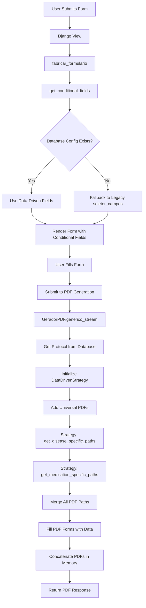
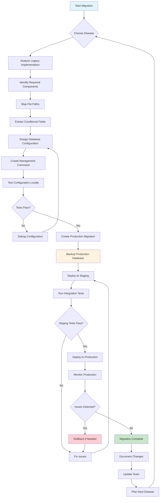

# Comprehensive Data-Driven PDF Generation Migration Guide

## Table of Contents
1. [Overview and Architecture](#overview)
2. [The Problem Analysis](#problem-analysis)
3. [The Data-Driven Solution](#solution)
4. [Implementation Flowchart](#flowchart)
5. [Step-by-Step Migration Process](#migration-process)
6. [Production Deployment Guide](#production-deployment)
7. [Disease-Specific Migration Templates](#disease-templates)
8. [Testing and Validation Framework](#testing-framework)
9. [Troubleshooting Guide](#troubleshooting)
10. [Best Practices and Considerations](#best-practices)

---

## 1. Overview and Architecture {#overview}

### 1.1 System Architecture Overview

The PDF generation system in this Django application handles medical prescription forms for different diseases. Each disease has unique requirements:

- **Universal Requirements**: All diseases need base LME forms, consent forms, reports, and exams
- **Disease-Specific Requirements**: Each disease has unique assessment scales (EDSS for MS, LANNS for chronic pain)
- **Medication-Specific Requirements**: Different medications require specific monitoring forms and consent variations

### 1.2 Current System Components

```
autocusto/
├── processos/
│   ├── manejo_pdfs_memory.py      # Main PDF generator (GeradorPDF)
│   ├── pdf_strategies.py          # Data-driven strategy classes
│   ├── forms.py                   # Dynamic form generation
│   ├── seletor.py                 # Legacy conditional fields (to be replaced)
│   ├── models.py                  # Protocolo model with dados_condicionais JSONField
│   └── management/commands/       # Migration commands
├── logica_raw/                    # Legacy disease classes (to be deprecated)
│   ├── esclerose_multipla.py      # MS-specific logic
│   ├── dor.py                     # Chronic pain logic
│   └── ...                       # Other disease classes
└── static/autocusto/protocolos/   # PDF templates organized by disease
    ├── esclerose_multipla/
    │   ├── consentimento.pdf       # Universal consent
    │   ├── pdfs_base/
    │   │   └── edss_modelo.pdf     # Disease-specific scale
    │   └── monitoramento_fingolimode_modelo.pdf  # Medication-specific
    └── ...
```

### 1.3 Data Flow Architecture



---

## 2. The Problem Analysis {#problem-analysis}

### 2.1 Scalability Crisis

**Current State**: Each disease requires hardcoded implementation
```python
# This pattern repeated for EVERY disease:
# logica_raw/esclerose_multipla.py (322 lines)
# logica_raw/dor.py (59 lines)  
# logica_raw/epilepsia.py (89 lines)
# logica_raw/alzheimer.py (156 lines)
# ... 50+ more files
```

**Problem**: Adding 1000 diseases means:
- 1000 Python class files
- 1000+ hardcoded path constants
- 50,000+ lines of repetitive code
- Exponential maintenance burden

### 2.2 Maintenance Nightmare

**Code Duplication Example**:
```python
# Pattern repeated in EVERY disease class:
def primeira_vez(self, dados_lme_base, dados_condicionais, path_lme_base):
    dados_lme_base.update(dados_condicionais)
    dados_finais = dados_lme_base
    medicamento = dados_finais["med1"].lower()
    emitir_exames = dados_finais["exames"]
    
    # Disease-specific logic varies, but structure is identical
    if "medication_a" in medicamento:
        # Hardcoded paths and logic
    elif "medication_b" in medicamento:
        # More hardcoded logic
    # ... repeated medication checks
```

**Problems**:
- Bug fixes require updating 50+ files
- New medication = update multiple disease classes
- Inconsistent implementations across diseases
- No central control over PDF generation logic

### 2.3 Form Field Generation Issues

**Current Implementation**:
```python
# processos/seletor.py - 149 lines of hardcoded conditions
def seletor_campos(protocolo):
    if protocolo.nome == "esclerose_multipla":
        campos = {
            "opt_edss": forms.ChoiceField(
                label="EDSS",
                initial=0,
                choices=[("0", "0"), ("0,5", "0,5"), ("1", "1"), ...],  # 21 hardcoded choices
                widget=forms.Select(attrs={"class": "custom-select"}),
            )
        }
    elif protocolo.nome == "dor_cronica":
        campos = {
            "opt_eva": forms.ChoiceField(
                label="EVA", 
                initial=10,
                choices=gerador_escolhas_numericas(4, 10),
                widget=forms.Select(attrs={"class": "custom-select"}),
            ),
            "opt_lanns": forms.ChoiceField(
                label="LANNS",
                initial="24",
                choices=gerador_escolhas_numericas(0, 24),
                widget=forms.Select(attrs={"class": "custom-select"}),
            ),
        }
    elif protocolo.nome == "doenca_de_alzheimer":
        campos = {
            "opt_ot1": forms.CharField(label="OT1", max_length=100),
            "opt_oe1": forms.CharField(label="OE1", max_length=100),
            "opt_mi": forms.CharField(label="MI", max_length=100),
            # ... 10 more hardcoded fields
        }
    # ... 20+ more elif conditions
```

**Problems**:
- 1000+ line function for 1000 diseases
- No flexibility for field customization
- Hard to test individual disease configurations
- Merge conflicts on every change

---

## 3. The Data-Driven Solution {#solution}

### 3.1 Architecture Principles

**Separation of Concerns**:
- **Universal Logic**: Handled by main `GeradorPDF`
- **Disease Logic**: Delegated to `DataDrivenStrategy`
- **Configuration**: Stored in database `JSONField`
- **File Discovery**: Based on directory structure + configuration

**Key Design Decisions**:
1. **Single Strategy Class**: One `DataDrivenStrategy` handles all diseases
2. **Database Configuration**: All disease-specific data in `Protocolo.dados_condicionais`
3. **Fallback Support**: Legacy system remains functional during migration
4. **Static File Integration**: Proper Django static file handling
5. **Memory Optimization**: Single unified PDF generator using RAM disk

### 3.2 Database Schema Design

**Protocol Configuration Structure**:
```json
{
  "1_vez": { ... },                    // Preserve existing data
  "fields": [                         // Conditional form fields
    {
      "name": "opt_edss",              // Form field name
      "label": "EDSS",                 // Display label
      "type": "choice",                // Field type
      "initial": "0",                  // Default value
      "choices": [                     // Available options
        ["0", "0"], ["0.5", "0.5"], ["1", "1"], ...
      ],
      "widget_class": "custom-select", // CSS class
      "required": true,                // Validation
      "help_text": "Expanded Disability Status Scale"
    }
  ],
  "disease_files": [                   // Disease-specific PDFs
    "pdfs_base/edss_modelo.pdf"
  ],
  "medications": {                     // Medication-specific configuration
    "fingolimode": {
      "files": ["monitoramento_fingolimode_modelo.pdf"],
      "consent_name": "fingolimode",
      "data_transforms": {             // Field name transformations
        "relatorio_fingolimode_1vez": "relatorio",
        "exames_em_1vez": "exames_solicitados"
      },
      "conditions": {                  // When to include files
        "primeira_vez": true,
        "monitoring_required": true
      }
    },
    "natalizumabe": {
      "files": ["exames_nata_modelo.pdf"],
      "consent_name": "natalizumabe",
      "data_transforms": {
        "relatorio_natalizumabe_1vez": "relatorio",
        "exames_nata_renova": "exames_solicitados"
      }
    }
  }
}
```

### 3.3 File Organization Strategy

**Directory Structure Convention**:
```
static/autocusto/protocolos/{protocol_name}/
├── consentimento.pdf                   # Universal consent (main generator)
├── pdfs_base/                         # Disease-specific files (strategy)
│   ├── {disease}_scale.pdf            # Assessment scales
│   ├── relatorio_modelo.pdf           # Universal report (main generator)
│   └── exames_modelo.pdf              # Universal exams (main generator)
├── {medication1}_monitoring.pdf       # Medication-specific (strategy)
├── {medication2}_specific_exams.pdf   # Medication-specific (strategy)
└── ...
```

**File Naming Conventions**:
- `{scale_name}_modelo.pdf` for assessment scales
- `{medication_name}_monitoring.pdf` for monitoring forms
- `{medication_name}_exames.pdf` for medication-specific exams
- `consentimento.pdf` for consent forms
- `relatorio_modelo.pdf` for reports

---

## 4. Implementation Flowchart {#flowchart}



### 4.1 Pre-Migration Checklist

**Analysis Phase**:
- [ ] Identify disease name and CID codes
- [ ] List all conditional fields required
- [ ] Map all PDF files and their purposes
- [ ] Document medication-specific requirements
- [ ] Check file naming consistency
- [ ] Verify static file paths exist

**Preparation Phase**:
- [ ] Create local development branch
- [ ] Backup production database
- [ ] Set up staging environment
- [ ] Prepare rollback procedures
- [ ] Document expected behavior

**Validation Phase**:
- [ ] Test form field generation
- [ ] Test PDF path resolution
- [ ] Test end-to-end PDF generation
- [ ] Verify legacy fallback works
- [ ] Performance testing

---

## 5. Step-by-Step Migration Process {#migration-process}

### 5.1 Phase 1: Analysis and Planning

#### Step 1.1: Analyze Legacy Implementation

**For each disease, examine the legacy class**:
```bash
# Find the legacy implementation
find logica_raw/ -name "*disease_name*"

# Example for Chronic Pain:
cat logica_raw/dor.py
```

**Extract key information**:
1. **Conditional Fields**: What fields are shown in forms?
2. **Disease Files**: What disease-specific PDFs are included?
3. **Medication Logic**: How are medications handled?
4. **File Paths**: What are the exact file names and paths?

#### Step 1.2: Map File Structure

**Document current file organization**:
```bash
# List all files for the disease
find static/autocusto/protocolos/disease_name/ -type f

# Example output for chronic pain:
static/autocusto/protocolos/dor_cronica/
├── consentimento.pdf
├── pdfs_base/
│   ├── lanns_scale.pdf
│   ├── eva_scale.pdf
│   └── relatorio_modelo.pdf
└── morphine_monitoring.pdf
```

#### Step 1.3: Extract Conditional Fields

**From `processos/seletor.py`, find the disease section**:
```python
# Example for chronic pain
elif protocolo.nome == "dor_cronica":
    campos = {
        "opt_eva": forms.ChoiceField(
            label="EVA",
            initial=10,
            choices=gerador_escolhas_numericas(4, 10),
            widget=forms.Select(attrs={"class": "custom-select"}),
        ),
        "opt_lanns": forms.ChoiceField(
            label="LANNS",
            initial="24", 
            choices=gerador_escolhas_numericas(0, 24),
            widget=forms.Select(attrs={"class": "custom-select"}),
        ),
    }
```

### 5.2 Phase 2: Configuration Design

#### Step 2.1: Design Database Configuration

**Template structure for new disease**:
```json
{
  "fields": [
    {
      "name": "opt_field_name",
      "label": "Display Label",
      "type": "choice|text|number",
      "initial": "default_value",
      "choices": [["value", "display"], ...],  // Only for choice fields
      "widget_class": "css-class",
      "required": true|false,
      "help_text": "Helper text"
    }
  ],
  "disease_files": [
    "pdfs_base/scale_file.pdf",
    "pdfs_base/another_assessment.pdf"
  ],
  "medications": {
    "medication_key": {
      "files": ["medication_specific.pdf"],
      "consent_name": "consent_identifier",
      "data_transforms": {
        "old_field_name": "new_field_name"
      },
      "conditions": {
        "primeira_vez": true|false,
        "custom_condition": "value"
      }
    }
  }
}
```

#### Step 2.2: Create Configuration for Chronic Pain Example

```json
{
  "fields": [
    {
      "name": "opt_eva",
      "label": "EVA",
      "type": "choice",
      "initial": "10",
      "choices": [
        ["4", "4"], ["5", "5"], ["6", "6"], ["7", "7"], 
        ["8", "8"], ["9", "9"], ["10", "10"]
      ],
      "widget_class": "custom-select",
      "required": true,
      "help_text": "Escala Visual Analógica da Dor"
    },
    {
      "name": "opt_lanns",
      "label": "LANNS",
      "type": "choice", 
      "initial": "24",
      "choices": [
        ["0", "0"], ["1", "1"], ["2", "2"], ["3", "3"],
        ["4", "4"], ["5", "5"], ["6", "6"], ["7", "7"],
        ["8", "8"], ["9", "9"], ["10", "10"], ["11", "11"],
        ["12", "12"], ["13", "13"], ["14", "14"], ["15", "15"],
        ["16", "16"], ["17", "17"], ["18", "18"], ["19", "19"],
        ["20", "20"], ["21", "21"], ["22", "22"], ["23", "23"],
        ["24", "24"]
      ],
      "widget_class": "custom-select",
      "required": true,
      "help_text": "Leeds Assessment of Neuropathic Symptoms and Signs"
    }
  ],
  "disease_files": [
    "pdfs_base/lanns_scale.pdf",
    "pdfs_base/eva_scale.pdf"
  ],
  "medications": {
    "morphine": {
      "files": ["morphine_monitoring.pdf"],
      "consent_name": "morphine",
      "data_transforms": {},
      "conditions": {
        "primeira_vez": true
      }
    },
    "tramadol": {
      "files": [],
      "consent_name": "tramadol", 
      "data_transforms": {},
      "conditions": {}
    }
  }
}
```

### 5.3 Phase 3: Implementation

#### Step 3.1: Create Management Command

**Create**: `processos/management/commands/configure_chronic_pain_protocol.py`

```python
# -*- coding: utf-8 -*-
"""
Management command to configure Chronic Pain protocol for data-driven PDF generation.

Usage:
    python manage.py configure_chronic_pain_protocol
"""

import json
from django.core.management.base import BaseCommand, CommandError
from processos.models import Protocolo, Doenca


class Command(BaseCommand):
    help = 'Configure Chronic Pain protocol for data-driven PDF generation'
    
    def add_arguments(self, parser):
        parser.add_argument(
            '--dry-run',
            action='store_true',
            help='Show what would be updated without making changes'
        )
        parser.add_argument(
            '--force',
            action='store_true',
            help='Force update even if configuration already exists'
        )
    
    def handle(self, *args, **options):
        # Find chronic pain protocol
        protocol = self.find_chronic_pain_protocol()
        if not protocol:
            raise CommandError('Chronic Pain protocol not found')
        
        # Check if already configured
        if not options['force'] and self.is_already_configured(protocol):
            self.stdout.write(
                self.style.WARNING(
                    f'Protocol {protocol.nome} already has data-driven configuration. '
                    'Use --force to override.'
                )
            )
            return
        
        # Show current state
        self.show_current_state(protocol)
        
        # Generate configuration
        config = self.generate_chronic_pain_configuration()
        
        # Show proposed changes
        self.show_proposed_configuration(config)
        
        if options['dry_run']:
            self.stdout.write(
                self.style.WARNING('DRY RUN - No changes made. Remove --dry-run to apply.')
            )
            return
        
        # Apply configuration
        self.update_protocol_configuration(protocol, config)
        
        # Show final state
        self.show_final_state(protocol)
    
    def find_chronic_pain_protocol(self):
        """Find Chronic Pain protocol by name or related disease CIDs"""
        # Try by protocol name first
        protocol = Protocolo.objects.filter(nome='dor_cronica').first()
        if protocol:
            return protocol
        
        # Try by disease CID patterns for chronic pain
        chronic_pain_cids = ['M79', 'R52', 'G89']  # Common chronic pain CIDs
        for cid_pattern in chronic_pain_cids:
            doenca = Doenca.objects.filter(cid__icontains=cid_pattern).first()
            if doenca and doenca.protocolo:
                return doenca.protocolo
        
        return None
    
    def is_already_configured(self, protocol):
        """Check if protocol already has data-driven configuration"""
        if not protocol.dados_condicionais:
            return False
        
        return (
            'fields' in protocol.dados_condicionais or
            'disease_files' in protocol.dados_condicionais or
            'medications' in protocol.dados_condicionais
        )
    
    def show_current_state(self, protocol):
        """Display current protocol state"""
        self.stdout.write(self.style.SUCCESS('\n=== CURRENT STATE ==='))
        self.stdout.write(f'Protocol: {protocol.nome} (ID: {protocol.id})')
        
        # Show related diseases
        diseases = protocol.doenca.all()
        if diseases:
            self.stdout.write(f'Related Diseases: {[f"{d.cid} ({d.nome})" for d in diseases]}')
        
        current_data = protocol.dados_condicionais
        if current_data:
            self.stdout.write('Current dados_condicionais:')
            self.stdout.write(json.dumps(current_data, indent=2, ensure_ascii=False))
        else:
            self.stdout.write('dados_condicionais: NULL')
    
    def generate_chronic_pain_configuration(self):
        """Generate configuration for Chronic Pain protocol"""
        return {
            "fields": [
                {
                    "name": "opt_eva",
                    "label": "EVA",
                    "type": "choice",
                    "initial": "10",
                    "choices": [
                        ["4", "4"], ["5", "5"], ["6", "6"], ["7", "7"],
                        ["8", "8"], ["9", "9"], ["10", "10"]
                    ],
                    "widget_class": "custom-select",
                    "required": True,
                    "help_text": "Escala Visual Analógica da Dor (4-10)"
                },
                {
                    "name": "opt_lanns",
                    "label": "LANNS",
                    "type": "choice",
                    "initial": "24",
                    "choices": [
                        ["0", "0"], ["1", "1"], ["2", "2"], ["3", "3"],
                        ["4", "4"], ["5", "5"], ["6", "6"], ["7", "7"],
                        ["8", "8"], ["9", "9"], ["10", "10"], ["11", "11"],
                        ["12", "12"], ["13", "13"], ["14", "14"], ["15", "15"],
                        ["16", "16"], ["17", "17"], ["18", "18"], ["19", "19"],
                        ["20", "20"], ["21", "21"], ["22", "22"], ["23", "23"],
                        ["24", "24"]
                    ],
                    "widget_class": "custom-select", 
                    "required": True,
                    "help_text": "Leeds Assessment of Neuropathic Symptoms and Signs (0-24)"
                }
            ],
            "disease_files": [
                "pdfs_base/lanns_scale.pdf",
                "pdfs_base/eva_scale.pdf"
            ],
            "medications": {
                "morphine": {
                    "files": ["morphine_monitoring.pdf"],
                    "consent_name": "morphine",
                    "data_transforms": {},
                    "conditions": {
                        "primeira_vez": True
                    }
                },
                "tramadol": {
                    "files": [],
                    "consent_name": "tramadol",
                    "data_transforms": {},
                    "conditions": {}
                },
                "codeine": {
                    "files": [],
                    "consent_name": "codeine",
                    "data_transforms": {},
                    "conditions": {}
                },
                "gabapentin": {
                    "files": ["gabapentin_monitoring.pdf"],
                    "consent_name": "gabapentin",
                    "data_transforms": {},
                    "conditions": {
                        "monitoring_required": True
                    }
                }
            }
        }
    
    def show_proposed_configuration(self, config):
        """Show what configuration would be applied"""
        self.stdout.write(self.style.WARNING('\n=== PROPOSED CONFIGURATION ==='))
        self.stdout.write('New data-driven configuration:')
        self.stdout.write(json.dumps(config, indent=2, ensure_ascii=False))
        
        # Verify file existence
        self.stdout.write('\n=== FILE VERIFICATION ===')
        self.verify_files(config)
    
    def verify_files(self, config):
        """Verify that referenced PDF files exist"""
        import os
        from django.conf import settings
        from processos.paths import get_static_path
        
        protocol_name = 'dor_cronica'  # Assuming chronic pain protocol name
        
        # Check disease-specific files
        for file_path in config.get('disease_files', []):
            full_path = get_static_path('protocolos', protocol_name, file_path)
            exists = os.path.exists(full_path)
            status = self.style.SUCCESS('✓ EXISTS') if exists else self.style.ERROR('✗ MISSING')
            self.stdout.write(f'  Disease file: {file_path} - {status}')
            if not exists:
                self.stdout.write(f'    Expected at: {full_path}')
        
        # Check medication-specific files
        for med_name, med_config in config.get('medications', {}).items():
            for file_path in med_config.get('files', []):
                full_path = get_static_path('protocolos', protocol_name, file_path)
                exists = os.path.exists(full_path)
                status = self.style.SUCCESS('✓ EXISTS') if exists else self.style.ERROR('✗ MISSING')
                self.stdout.write(f'  {med_name} file: {file_path} - {status}')
                if not exists:
                    self.stdout.write(f'    Expected at: {full_path}')
    
    def update_protocol_configuration(self, protocol, config):
        """Apply the configuration to the protocol"""
        try:
            # Preserve existing data
            current_data = protocol.dados_condicionais or {}
            
            # Add new configuration
            current_data.update(config)
            
            # Save to database
            protocol.dados_condicionais = current_data
            protocol.save()
            
            self.stdout.write(
                self.style.SUCCESS('\n✓ Configuration applied successfully!')
            )
            
        except Exception as e:
            raise CommandError(f'Failed to update protocol configuration: {e}')
    
    def show_final_state(self, protocol):
        """Display final protocol state"""
        self.stdout.write(self.style.SUCCESS('\n=== FINAL STATE ==='))
        
        # Refresh from database
        protocol.refresh_from_db()
        
        self.stdout.write(f'Protocol: {protocol.nome} (ID: {protocol.id})')
        self.stdout.write('Final dados_condicionais:')
        self.stdout.write(json.dumps(protocol.dados_condicionais, indent=2, ensure_ascii=False))
```

#### Step 3.2: Test Management Command

```bash
# Test with dry run first
python manage.py configure_chronic_pain_protocol --dry-run

# Apply the configuration
python manage.py configure_chronic_pain_protocol

# Force update if needed
python manage.py configure_chronic_pain_protocol --force
```

#### Step 3.3: Validation Testing

**Test conditional fields generation**:
```python
python manage.py shell -c "
from processos.models import Protocolo
from processos.pdf_strategies import get_conditional_fields

# Find chronic pain protocol
protocol = Protocolo.objects.filter(nome='dor_cronica').first()
if protocol:
    fields = get_conditional_fields(protocol)
    print(f'✓ Generated {len(fields)} fields: {list(fields.keys())}')
    
    # Test specific fields
    if 'opt_eva' in fields:
        eva_field = fields['opt_eva']
        print(f'✓ EVA field: {eva_field.label}, choices: {len(eva_field.choices)}')
    
    if 'opt_lanns' in fields:
        lanns_field = fields['opt_lanns']
        print(f'✓ LANNS field: {lanns_field.label}, choices: {len(lanns_field.choices)}')
else:
    print('✗ Chronic pain protocol not found')
"
```

**Test PDF path resolution**:
```python
python manage.py shell -c "
from processos.models import Protocolo
from processos.pdf_strategies import DataDrivenStrategy

protocol = Protocolo.objects.filter(nome='dor_cronica').first()
if protocol:
    strategy = DataDrivenStrategy(protocol)
    
    # Test disease-specific paths
    disease_paths = strategy.get_disease_specific_paths({'cid': 'R52'})
    print(f'✓ Disease paths: {disease_paths}')
    
    # Test medication-specific paths
    morphine_paths = strategy.get_medication_specific_paths({'med1': 'morphine'})
    print(f'✓ Morphine paths: {morphine_paths}')
    
    gabapentin_paths = strategy.get_medication_specific_paths({'med1': 'gabapentin'})
    print(f'✓ Gabapentin paths: {gabapentin_paths}')
else:
    print('✗ Chronic pain protocol not found')
"
```

### 5.4 Phase 4: Integration Testing

#### Step 4.1: Form Generation Test

**Test that forms include new conditional fields**:
```python
python manage.py shell -c "
from processos.forms import fabricar_formulario

# Test chronic pain form generation
try:
    # Replace 'R52' with actual chronic pain CID in your system
    form_class = fabricar_formulario('R52', renovar=False)
    form = form_class()
    
    # Check if conditional fields are present
    field_names = list(form.fields.keys())
    conditional_fields = [f for f in field_names if f.startswith('opt_')]
    
    print(f'✓ Form generated successfully')
    print(f'✓ Total fields: {len(field_names)}')
    print(f'✓ Conditional fields: {conditional_fields}')
    
    # Test specific conditional fields
    if 'opt_eva' in form.fields:
        eva_field = form.fields['opt_eva']
        print(f'✓ EVA field: {eva_field.label}, choices: {len(eva_field.choices)}')
    
    if 'opt_lanns' in form.fields:
        lanns_field = form.fields['opt_lanns']
        print(f'✓ LANNS field: {lanns_field.label}, choices: {len(lanns_field.choices)}')
        
except Exception as e:
    print(f'✗ Form generation failed: {e}')
    import traceback
    traceback.print_exc()
"
```

#### Step 4.2: End-to-End PDF Generation Test

**Create a comprehensive test**:
```python
# Create test file: test_chronic_pain_migration.py
import os
import tempfile
from django.test import TestCase
from django.conf import settings
from processos.models import Protocolo, Doenca
from processos.pdf_strategies import DataDrivenStrategy, get_conditional_fields
from processos.manejo_pdfs_memory import GeradorPDF


class ChronicPainMigrationTest(TestCase):
    def setUp(self):
        """Set up test data"""
        # Create test protocol and disease
        self.protocol = Protocolo.objects.create(
            nome='dor_cronica',
            arquivo='test_protocol.pdf',
            dados_condicionais={
                "fields": [
                    {
                        "name": "opt_eva",
                        "label": "EVA",
                        "type": "choice",
                        "initial": "10",
                        "choices": [["4", "4"], ["5", "5"], ["6", "6"], ["7", "7"],
                                   ["8", "8"], ["9", "9"], ["10", "10"]],
                        "widget_class": "custom-select"
                    }
                ],
                "disease_files": ["pdfs_base/eva_scale.pdf"],
                "medications": {
                    "morphine": {
                        "files": ["morphine_monitoring.pdf"],
                        "consent_name": "morphine"
                    }
                }
            }
        )
        
        self.disease = Doenca.objects.create(
            cid='R52',
            nome='Chronic Pain',
            protocolo=self.protocol
        )
    
    def test_conditional_fields_generation(self):
        """Test that conditional fields are generated correctly"""
        fields = get_conditional_fields(self.protocol)
        
        self.assertIn('opt_eva', fields)
        eva_field = fields['opt_eva']
        self.assertEqual(eva_field.label, 'EVA')
        self.assertEqual(len(eva_field.choices), 7)  # 4-10 = 7 choices
    
    def test_strategy_initialization(self):
        """Test that DataDrivenStrategy initializes correctly"""
        strategy = DataDrivenStrategy(self.protocol)
        self.assertEqual(strategy.protocolo, self.protocol)
    
    def test_disease_specific_paths(self):
        """Test disease-specific PDF path resolution"""
        strategy = DataDrivenStrategy(self.protocol)
        
        mock_data = {'cid': 'R52'}
        paths = strategy.get_disease_specific_paths(mock_data)
        
        # Should return paths even if files don't exist (for testing)
        self.assertIsInstance(paths, list)
    
    def test_medication_specific_paths(self):
        """Test medication-specific PDF path resolution"""
        strategy = DataDrivenStrategy(self.protocol)
        
        mock_data = {'cid': 'R52', 'med1': 'morphine'}
        paths = strategy.get_medication_specific_paths(mock_data)
        
        self.assertIsInstance(paths, list)
    
    def test_legacy_fallback(self):
        """Test that legacy system still works for unconfigured protocols"""
        # Create protocol without data-driven configuration
        legacy_protocol = Protocolo.objects.create(
            nome='legacy_disease',
            arquivo='legacy_protocol.pdf'
        )
        
        fields = get_conditional_fields(legacy_protocol)
        self.assertEqual(fields, {})  # Should return empty dict and fallback to legacy


# Run the test
python manage.py test test_chronic_pain_migration.ChronicPainMigrationTest
```

---

## 6. Production Deployment Guide {#production-deployment}

### 6.1 Pre-Production Checklist

**Database Backup Requirements**:
- [ ] Full database backup with timestamp
- [ ] Backup verification (restore test on staging)
- [ ] Rollback procedures documented
- [ ] Database backup retention policy confirmed

**Code Deployment Requirements**:
- [ ] All changes committed to version control
- [ ] Code review completed and approved
- [ ] Staging deployment tested successfully
- [ ] Production deployment plan documented

**Monitoring and Alerts**:
- [ ] Error monitoring configured
- [ ] Performance metrics baseline established
- [ ] Alert thresholds defined
- [ ] On-call procedures updated

### 6.2 Staging Environment Testing

#### Step 6.2.1: Deploy to Staging

```bash
# 1. Deploy code changes to staging
git checkout production
git merge feature/chronic-pain-migration
git push staging production

# 2. Run database migrations if any
python manage.py migrate --settings=autocusto.settings.staging

# 3. Apply protocol configuration
python manage.py configure_chronic_pain_protocol --settings=autocusto.settings.staging

# 4. Collect static files
python manage.py collectstatic --noinput --settings=autocusto.settings.staging
```

#### Step 6.2.2: Staging Test Suite

```bash
# Run comprehensive test suite
python manage.py test --settings=autocusto.settings.staging

# Test specific chronic pain functionality
python manage.py test test_chronic_pain_migration --settings=autocusto.settings.staging

# Load testing with realistic data
python manage.py test_pdf_generation_performance --settings=autocusto.settings.staging
```

#### Step 6.2.3: Manual Staging Tests

**Test Scenarios**:
1. **Form Generation**: Create new chronic pain patient form
2. **Field Validation**: Test all conditional fields work correctly
3. **PDF Generation**: Generate PDFs for different medications
4. **Legacy Fallback**: Test that other diseases still work
5. **Performance**: Measure PDF generation time
6. **Error Handling**: Test with invalid data

### 6.3 Production Deployment Strategy

#### Option A: Blue-Green Deployment (Recommended)

```bash
# 1. Prepare green environment
cp -r production_blue production_green
cd production_green

# 2. Deploy code to green
git pull origin production
docker-compose build
docker-compose up -d

# 3. Run database migration on green
docker-compose exec web python manage.py configure_chronic_pain_protocol

# 4. Test green environment
./scripts/smoke_test.sh production_green

# 5. Switch traffic to green
./scripts/switch_traffic.sh blue green

# 6. Monitor for issues
./scripts/monitor_production.sh green 300  # Monitor for 5 minutes

# 7. If successful, decommission blue
# If issues, switch back to blue
```

#### Option B: Rolling Deployment

```bash
# 1. Database backup
pg_dump autocusto_production > backup_$(date +%Y%m%d_%H%M%S).sql

# 2. Deploy code (no database changes required)
git pull origin production
docker-compose build
docker-compose up -d --no-deps web

# 3. Apply configuration (safe - only updates JSON field)
docker-compose exec web python manage.py configure_chronic_pain_protocol

# 4. Monitor application
tail -f logs/autocusto.log | grep -E "(ERROR|CRITICAL|chronic_pain)"
```

### 6.4 Production Database Migration

#### Step 6.4.1: Safe Migration Script

**Create**: `scripts/safe_production_migration.py`

```python
#!/usr/bin/env python
"""
Safe production migration script for chronic pain protocol.
This script includes safety checks and rollback capabilities.
"""

import json
import sys
import traceback
from datetime import datetime
from django.core.management.base import BaseCommand
from django.db import transaction
from processos.models import Protocolo


class SafeProductionMigration:
    def __init__(self):
        self.backup_data = {}
        self.migration_log = []
    
    def log(self, message):
        """Log migration steps with timestamp"""
        timestamp = datetime.now().isoformat()
        log_entry = f"[{timestamp}] {message}"
        self.migration_log.append(log_entry)
        print(log_entry)
    
    def backup_protocol_data(self, protocol):
        """Create backup of protocol data before modification"""
        self.backup_data[protocol.id] = {
            'nome': protocol.nome,
            'arquivo': protocol.arquivo,
            'dados_condicionais': protocol.dados_condicionais,
            'backup_timestamp': datetime.now().isoformat()
        }
        self.log(f"Backed up protocol {protocol.nome} (ID: {protocol.id})")
    
    def verify_protocol_exists(self):
        """Verify that chronic pain protocol exists"""
        protocol = Protocolo.objects.filter(nome='dor_cronica').first()
        if not protocol:
            raise Exception("Chronic pain protocol not found in database")
        
        self.log(f"Found chronic pain protocol: {protocol.nome} (ID: {protocol.id})")
        return protocol
    
    def check_existing_configuration(self, protocol):
        """Check if protocol already has data-driven configuration"""
        if not protocol.dados_condicionais:
            self.log("Protocol has no existing dados_condicionais")
            return False
        
        has_fields = 'fields' in protocol.dados_condicionais
        has_disease_files = 'disease_files' in protocol.dados_condicionais
        has_medications = 'medications' in protocol.dados_condicionais
        
        if has_fields or has_disease_files or has_medications:
            self.log("WARNING: Protocol already has data-driven configuration")
            return True
        
        self.log("Protocol has dados_condicionais but no data-driven config")
        return False
    
    def generate_configuration(self):
        """Generate chronic pain configuration"""
        return {
            "fields": [
                {
                    "name": "opt_eva",
                    "label": "EVA",
                    "type": "choice",
                    "initial": "10",
                    "choices": [
                        ["4", "4"], ["5", "5"], ["6", "6"], ["7", "7"],
                        ["8", "8"], ["9", "9"], ["10", "10"]
                    ],
                    "widget_class": "custom-select",
                    "required": True
                },
                {
                    "name": "opt_lanns",
                    "label": "LANNS",
                    "type": "choice",
                    "initial": "24",
                    "choices": [
                        ["0", "0"], ["1", "1"], ["2", "2"], ["3", "3"],
                        ["4", "4"], ["5", "5"], ["6", "6"], ["7", "7"],
                        ["8", "8"], ["9", "9"], ["10", "10"], ["11", "11"],
                        ["12", "12"], ["13", "13"], ["14", "14"], ["15", "15"],
                        ["16", "16"], ["17", "17"], ["18", "18"], ["19", "19"],
                        ["20", "20"], ["21", "21"], ["22", "22"], ["23", "23"],
                        ["24", "24"]
                    ],
                    "widget_class": "custom-select",
                    "required": True
                }
            ],
            "disease_files": [
                "pdfs_base/lanns_scale.pdf",
                "pdfs_base/eva_scale.pdf"
            ],
            "medications": {
                "morphine": {
                    "files": ["morphine_monitoring.pdf"],
                    "consent_name": "morphine"
                },
                "tramadol": {
                    "files": [],
                    "consent_name": "tramadol"
                },
                "gabapentin": {
                    "files": ["gabapentin_monitoring.pdf"],
                    "consent_name": "gabapentin"
                }
            }
        }
    
    def apply_configuration(self, protocol, config, force=False):
        """Apply configuration with safety checks"""
        if not force and self.check_existing_configuration(protocol):
            response = input("Protocol already configured. Continue? (yes/no): ")
            if response.lower() != 'yes':
                raise Exception("Migration cancelled by user")
        
        # Backup current data
        self.backup_protocol_data(protocol)
        
        # Apply configuration
        current_data = protocol.dados_condicionais or {}
        current_data.update(config)
        
        with transaction.atomic():
            protocol.dados_condicionais = current_data
            protocol.save()
        
        self.log(f"Applied configuration to protocol {protocol.nome}")
    
    def verify_migration(self, protocol):
        """Verify that migration was applied correctly"""
        protocol.refresh_from_db()
        
        config = protocol.dados_condicionais
        if not config:
            raise Exception("Migration failed: dados_condicionais is empty")
        
        # Check required keys
        required_keys = ['fields', 'disease_files', 'medications']
        for key in required_keys:
            if key not in config:
                raise Exception(f"Migration failed: {key} not found in configuration")
        
        # Check field count
        fields = config['fields']
        if len(fields) != 2:
            raise Exception(f"Migration failed: Expected 2 fields, found {len(fields)}")
        
        # Check field names
        field_names = [f['name'] for f in fields]
        expected_fields = ['opt_eva', 'opt_lanns']
        for expected_field in expected_fields:
            if expected_field not in field_names:
                raise Exception(f"Migration failed: Field {expected_field} not found")
        
        self.log("Migration verification passed")
    
    def create_rollback_script(self):
        """Create rollback script for this migration"""
        script_content = f"""#!/usr/bin/env python
# Rollback script for chronic pain migration
# Generated on {datetime.now().isoformat()}

import json
from django.core.management.base import BaseCommand
from processos.models import Protocolo

def rollback():
    backup_data = {json.dumps(self.backup_data, indent=2)}
    
    for protocol_id, backup in backup_data.items():
        try:
            protocol = Protocolo.objects.get(id=protocol_id)
            protocol.dados_condicionais = backup['dados_condicionais']
            protocol.save()
            print(f"Rolled back protocol {{protocol.nome}} (ID: {{protocol_id}})")
        except Exception as e:
            print(f"Failed to rollback protocol {{protocol_id}}: {{e}}")

if __name__ == '__main__':
    rollback()
"""
        
        rollback_file = f"rollback_chronic_pain_{datetime.now().strftime('%Y%m%d_%H%M%S')}.py"
        with open(rollback_file, 'w') as f:
            f.write(script_content)
        
        self.log(f"Created rollback script: {rollback_file}")
        return rollback_file
    
    def run_migration(self, force=False):
        """Run the complete migration process"""
        try:
            self.log("Starting chronic pain protocol migration")
            
            # Step 1: Verify protocol exists
            protocol = self.verify_protocol_exists()
            
            # Step 2: Generate configuration
            config = self.generate_configuration()
            self.log("Generated configuration")
            
            # Step 3: Apply configuration
            self.apply_configuration(protocol, config, force)
            
            # Step 4: Verify migration
            self.verify_migration(protocol)
            
            # Step 5: Create rollback script
            rollback_file = self.create_rollback_script()
            
            self.log("Migration completed successfully")
            self.log(f"Rollback script: {rollback_file}")
            
            return True
            
        except Exception as e:
            self.log(f"Migration failed: {e}")
            self.log("Traceback:")
            for line in traceback.format_exc().split('\n'):
                self.log(line)
            return False


if __name__ == '__main__':
    import os
    import django
    
    # Setup Django
    os.environ.setdefault('DJANGO_SETTINGS_MODULE', 'autocusto.settings.production')
    django.setup()
    
    # Run migration
    migration = SafeProductionMigration()
    force = '--force' in sys.argv
    
    success = migration.run_migration(force=force)
    if not success:
        sys.exit(1)
```

#### Step 6.4.2: Execute Production Migration

```bash
# 1. Create production database backup
pg_dump autocusto_production > backup_chronic_pain_$(date +%Y%m%d_%H%M%S).sql

# 2. Run safe migration script
python scripts/safe_production_migration.py

# 3. Verify migration success
python manage.py shell -c "
from processos.models import Protocolo
protocol = Protocolo.objects.get(nome='dor_cronica')
config = protocol.dados_condicionais
print('Migration verification:')
print(f'- Fields configured: {\"fields\" in config}')
print(f'- Disease files configured: {\"disease_files\" in config}')
print(f'- Medications configured: {\"medications\" in config}')
if 'fields' in config:
    print(f'- Number of fields: {len(config[\"fields\"])}')
"

# 4. Test form generation
python manage.py shell -c "
from processos.pdf_strategies import get_conditional_fields
from processos.models import Protocolo
protocol = Protocolo.objects.get(nome='dor_cronica')
fields = get_conditional_fields(protocol)
print(f'Form fields generated: {list(fields.keys())}')
"

# 5. Monitor application logs
tail -f /var/log/autocusto/application.log | grep -E "(chronic_pain|dor_cronica|ERROR)"
```

### 6.5 Post-Deployment Monitoring

#### Step 6.5.1: Immediate Health Checks

```bash
# 1. Application health check
curl -f http://localhost:8000/health/ || echo "Health check failed"

# 2. PDF generation test
python manage.py shell -c "
from processos.pdf_strategies import DataDrivenStrategy
from processos.models import Protocolo
try:
    protocol = Protocolo.objects.get(nome='dor_cronica')
    strategy = DataDrivenStrategy(protocol)
    paths = strategy.get_disease_specific_paths({'cid': 'R52'})
    print(f'✓ PDF path resolution working: {len(paths)} paths found')
except Exception as e:
    print(f'✗ PDF path resolution failed: {e}')
"

# 3. Database connection test
python manage.py shell -c "
from django.db import connection
cursor = connection.cursor()
cursor.execute('SELECT COUNT(*) FROM processos_protocolo')
count = cursor.fetchone()[0]
print(f'✓ Database connection working: {count} protocols found')
"
```

#### Step 6.5.2: Extended Monitoring (24 hours)

**Set up monitoring alerts**:
```bash
# Monitor error rates
tail -f /var/log/autocusto/application.log | \
grep -E "ERROR|CRITICAL" | \
while read line; do
    echo "$(date): $line"
    # Send alert if chronic pain related
    if echo "$line" | grep -q "chronic_pain\|dor_cronica"; then
        echo "ALERT: Chronic pain error detected: $line" | \
        mail -s "Chronic Pain Migration Issue" oncall@company.com
    fi
done

# Monitor PDF generation performance
python scripts/monitor_pdf_performance.py --disease=dor_cronica --duration=86400
```

---

## 7. Disease-Specific Migration Templates {#disease-templates}

### 7.1 Simple Disease Template (No Medications)

**Example: Basic Assessment Disease**

```python
# Template for diseases with only assessment scales
def generate_simple_disease_configuration():
    return {
        "fields": [
            {
                "name": "opt_assessment_scale",
                "label": "Assessment Scale Name",
                "type": "choice",
                "initial": "0",
                "choices": [["0", "0"], ["1", "1"], ["2", "2"], ["3", "3"], ["4", "4"]],
                "widget_class": "custom-select",
                "required": True,
                "help_text": "Description of the assessment scale"
            }
        ],
        "disease_files": [
            "pdfs_base/assessment_scale.pdf"
        ],
        "medications": {}  # No medication-specific requirements
    }
```

### 7.2 Complex Disease Template (Multiple Medications)

**Example: Multiple Sclerosis Pattern**

```python
def generate_complex_disease_configuration():
    return {
        "fields": [
            {
                "name": "opt_primary_scale",
                "label": "Primary Assessment",
                "type": "choice",
                "initial": "0",
                "choices": [["0", "0"], ["0.5", "0.5"], ...],  # Full range
                "widget_class": "custom-select",
                "required": True
            },
            {
                "name": "opt_secondary_assessment",
                "label": "Secondary Assessment",
                "type": "text",
                "initial": "",
                "max_length": 200,
                "widget_class": "form-control",
                "required": False
            }
        ],
        "disease_files": [
            "pdfs_base/primary_scale.pdf",
            "pdfs_base/secondary_assessment.pdf"
        ],
        "medications": {
            "medication_a": {
                "files": ["medication_a_monitoring.pdf"],
                "consent_name": "medication_a_consent_id",
                "data_transforms": {
                    "medication_a_field_old": "medication_a_field_new"
                },
                "conditions": {
                    "primeira_vez": True,
                    "monitoring_required": True
                }
            },
            "medication_b": {
                "files": ["medication_b_specific.pdf", "medication_b_monitoring.pdf"],
                "consent_name": "medication_b_consent_id",
                "data_transforms": {
                    "medication_b_report": "relatorio",
                    "medication_b_exams": "exames_solicitados"
                },
                "conditions": {
                    "primeira_vez": True,
                    "specialized_monitoring": True
                }
            }
        }
    }
```

### 7.3 Pediatric Disease Template

**Example: Age-Specific Requirements**

```python
def generate_pediatric_disease_configuration():
    return {
        "fields": [
            {
                "name": "opt_age_group",
                "label": "Age Group",
                "type": "choice",
                "initial": "child",
                "choices": [
                    ["infant", "Infant (0-2 years)"],
                    ["child", "Child (2-12 years)"],
                    ["adolescent", "Adolescent (12-18 years)"]
                ],
                "widget_class": "custom-select",
                "required": True
            },
            {
                "name": "opt_development_scale",
                "label": "Development Assessment",
                "type": "choice",
                "initial": "normal",
                "choices": [
                    ["delayed", "Delayed"],
                    ["normal", "Normal"],
                    ["advanced", "Advanced"]
                ],
                "widget_class": "custom-select",
                "required": True
            }
        ],
        "disease_files": [
            "pdfs_base/pediatric_assessment.pdf",
            "pdfs_base/development_scale.pdf"
        ],
        "medications": {
            "pediatric_medication": {
                "files": ["pediatric_dosing.pdf", "pediatric_monitoring.pdf"],
                "consent_name": "pediatric_consent",
                "data_transforms": {},
                "conditions": {
                    "primeira_vez": True,
                    "age_appropriate": True,
                    "parent_consent": True
                }
            }
        }
    }
```

### 7.4 Migration Command Template

**Generic template for any disease**:

```python
# -*- coding: utf-8 -*-
"""
Management command template for configuring any disease protocol.
Copy this file and customize for specific diseases.

Usage:
    python manage.py configure_{disease_name}_protocol
"""

import json
from django.core.management.base import BaseCommand, CommandError
from processos.models import Protocolo, Doenca


class Command(BaseCommand):
    help = 'Configure {DISEASE_NAME} protocol for data-driven PDF generation'
    
    # CUSTOMIZE THESE VALUES FOR EACH DISEASE
    PROTOCOL_NAME = 'disease_name'  # e.g., 'dor_cronica'
    DISEASE_DISPLAY_NAME = 'Disease Name'  # e.g., 'Chronic Pain'
    DISEASE_CID_PATTERNS = ['CID1', 'CID2']  # e.g., ['M79', 'R52', 'G89']
    
    def add_arguments(self, parser):
        parser.add_argument('--dry-run', action='store_true')
        parser.add_argument('--force', action='store_true')
    
    def handle(self, *args, **options):
        protocol = self.find_protocol()
        if not protocol:
            raise CommandError(f'{self.DISEASE_DISPLAY_NAME} protocol not found')
        
        if not options['force'] and self.is_already_configured(protocol):
            self.stdout.write(
                self.style.WARNING(
                    f'Protocol {protocol.nome} already configured. Use --force to override.'
                )
            )
            return
        
        self.show_current_state(protocol)
        config = self.generate_configuration()
        self.show_proposed_configuration(config)
        
        if options['dry_run']:
            self.stdout.write(self.style.WARNING('DRY RUN - No changes made.'))
            return
        
        self.update_protocol_configuration(protocol, config)
        self.show_final_state(protocol)
    
    def find_protocol(self):
        """Find protocol by name or related disease CIDs"""
        # Try by protocol name first
        protocol = Protocolo.objects.filter(nome=self.PROTOCOL_NAME).first()
        if protocol:
            return protocol
        
        # Try by disease CID patterns
        for cid_pattern in self.DISEASE_CID_PATTERNS:
            doenca = Doenca.objects.filter(cid__icontains=cid_pattern).first()
            if doenca and doenca.protocolo:
                return doenca.protocolo
        
        return None
    
    def is_already_configured(self, protocol):
        """Check if protocol already has data-driven configuration"""
        if not protocol.dados_condicionais:
            return False
        
        return (
            'fields' in protocol.dados_condicionais or
            'disease_files' in protocol.dados_condicionais or
            'medications' in protocol.dados_condicionais
        )
    
    def generate_configuration(self):
        """CUSTOMIZE THIS METHOD FOR EACH DISEASE"""
        return {
            "fields": [
                # Add disease-specific form fields here
                {
                    "name": "opt_example_field",
                    "label": "Example Field",
                    "type": "choice",
                    "initial": "0",
                    "choices": [["0", "0"], ["1", "1"], ["2", "2"]],
                    "widget_class": "custom-select",
                    "required": True,
                    "help_text": "Example help text"
                }
            ],
            "disease_files": [
                # Add disease-specific PDF files here
                "pdfs_base/example_scale.pdf"
            ],
            "medications": {
                # Add medication-specific configurations here
                "example_medication": {
                    "files": ["example_monitoring.pdf"],
                    "consent_name": "example_consent",
                    "data_transforms": {},
                    "conditions": {
                        "primeira_vez": True
                    }
                }
            }
        }
    
    # ... (include other template methods from chronic pain example)
```

---

## 8. Testing and Validation Framework {#testing-framework}

### 8.1 Automated Test Suite

**Create comprehensive test framework**:

```python
# tests/test_data_driven_migration.py
import os
import json
from django.test import TestCase, TransactionTestCase
from django.conf import settings
from processos.models import Protocolo, Doenca, Medicamento
from processos.pdf_strategies import DataDrivenStrategy, get_conditional_fields
from processos.forms import fabricar_formulario
from processos.manejo_pdfs_memory import GeradorPDF


class DataDrivenMigrationTestCase(TestCase):
    """Base test case for data-driven migration testing"""
    
    def setUp(self):
        """Set up common test data"""
        self.test_protocol = Protocolo.objects.create(
            nome='test_disease',
            arquivo='test_protocol.pdf'
        )
        
        self.test_disease = Doenca.objects.create(
            cid='T99',
            nome='Test Disease',
            protocolo=self.test_protocol
        )
        
        self.test_medication = Medicamento.objects.create(
            nome='Test Medication',
            dosagem='10mg',
            apres='tablet'
        )
        
        self.test_protocol.medicamentos.add(self.test_medication)
    
    def create_test_configuration(self, include_fields=True, include_files=True, include_medications=True):
        """Create test configuration with optional components"""
        config = {}
        
        if include_fields:
            config["fields"] = [
                {
                    "name": "opt_test_field",
                    "label": "Test Field",
                    "type": "choice",
                    "initial": "0",
                    "choices": [["0", "0"], ["1", "1"], ["2", "2"]],
                    "widget_class": "custom-select",
                    "required": True
                }
            ]
        
        if include_files:
            config["disease_files"] = ["pdfs_base/test_scale.pdf"]
        
        if include_medications:
            config["medications"] = {
                "test_medication": {
                    "files": ["test_monitoring.pdf"],
                    "consent_name": "test_consent"
                }
            }
        
        return config
    
    def apply_test_configuration(self, config):
        """Apply configuration to test protocol"""
        current_data = self.test_protocol.dados_condicionais or {}
        current_data.update(config)
        self.test_protocol.dados_condicionais = current_data
        self.test_protocol.save()


class ConditionalFieldsTest(DataDrivenMigrationTestCase):
    """Test conditional form field generation"""
    
    def test_empty_configuration_returns_empty_fields(self):
        """Test that empty configuration returns no fields"""
        fields = get_conditional_fields(self.test_protocol)
        self.assertEqual(fields, {})
    
    def test_choice_field_generation(self):
        """Test that choice fields are generated correctly"""
        config = self.create_test_configuration(include_files=False, include_medications=False)
        self.apply_test_configuration(config)
        
        fields = get_conditional_fields(self.test_protocol)
        
        self.assertIn('opt_test_field', fields)
        test_field = fields['opt_test_field']
        self.assertEqual(test_field.label, 'Test Field')
        self.assertEqual(len(test_field.choices), 3)
        self.assertEqual(test_field.initial, '0')
    
    def test_multiple_fields_generation(self):
        """Test generation of multiple conditional fields"""
        config = {
            "fields": [
                {
                    "name": "opt_field_1",
                    "label": "Field 1",
                    "type": "choice",
                    "choices": [["a", "A"], ["b", "B"]]
                },
                {
                    "name": "opt_field_2", 
                    "label": "Field 2",
                    "type": "choice",
                    "choices": [["x", "X"], ["y", "Y"], ["z", "Z"]]
                }
            ]
        }
        self.apply_test_configuration(config)
        
        fields = get_conditional_fields(self.test_protocol)
        
        self.assertEqual(len(fields), 2)
        self.assertIn('opt_field_1', fields)
        self.assertIn('opt_field_2', fields)
        self.assertEqual(len(fields['opt_field_1'].choices), 2)
        self.assertEqual(len(fields['opt_field_2'].choices), 3)


class DataDrivenStrategyTest(DataDrivenMigrationTestCase):
    """Test DataDrivenStrategy functionality"""
    
    def test_strategy_initialization(self):
        """Test that strategy initializes correctly"""
        strategy = DataDrivenStrategy(self.test_protocol)
        self.assertEqual(strategy.protocolo, self.test_protocol)
    
    def test_empty_configuration_returns_empty_paths(self):
        """Test that empty configuration returns no paths"""
        strategy = DataDrivenStrategy(self.test_protocol)
        
        disease_paths = strategy.get_disease_specific_paths({})
        medication_paths = strategy.get_medication_specific_paths({})
        
        self.assertEqual(disease_paths, [])
        self.assertEqual(medication_paths, [])
    
    def test_disease_specific_path_resolution(self):
        """Test disease-specific PDF path resolution"""
        config = self.create_test_configuration(include_fields=False, include_medications=False)
        self.apply_test_configuration(config)
        
        strategy = DataDrivenStrategy(self.test_protocol)
        paths = strategy.get_disease_specific_paths({})
        
        # Should return paths even if files don't exist (for testing)
        self.assertIsInstance(paths, list)
    
    def test_medication_specific_path_resolution(self):
        """Test medication-specific PDF path resolution"""
        config = self.create_test_configuration(include_fields=False, include_files=False)
        self.apply_test_configuration(config)
        
        strategy = DataDrivenStrategy(self.test_protocol)
        paths = strategy.get_medication_specific_paths({'med1': 'test_medication'})
        
        self.assertIsInstance(paths, list)
    
    def test_medication_matching_logic(self):
        """Test that medication matching works with partial names"""
        config = {
            "medications": {
                "partial_name": {
                    "files": ["partial_monitoring.pdf"],
                    "consent_name": "partial_consent"
                }
            }
        }
        self.apply_test_configuration(config)
        
        strategy = DataDrivenStrategy(self.test_protocol)
        
        # Should match when medication contains the key
        paths = strategy.get_medication_specific_paths({'med1': 'full_partial_name_extended'})
        self.assertIsInstance(paths, list)


class FormGenerationTest(DataDrivenMigrationTestCase):
    """Test form generation with data-driven fields"""
    
    def test_form_generation_with_conditional_fields(self):
        """Test that forms include conditional fields"""
        config = self.create_test_configuration(include_files=False, include_medications=False)
        self.apply_test_configuration(config)
        
        try:
            form_class = fabricar_formulario('T99', renovar=False)
            form = form_class()
            
            # Check that conditional field is present
            self.assertIn('opt_test_field', form.fields)
            
            # Verify field properties
            test_field = form.fields['opt_test_field']
            self.assertEqual(test_field.label, 'Test Field')
            
        except Exception as e:
            self.fail(f"Form generation failed: {e}")
    
    def test_legacy_fallback_functionality(self):
        """Test that legacy system still works for unconfigured protocols"""
        # Don't apply any configuration - should fallback to legacy
        
        try:
            form_class = fabricar_formulario('T99', renovar=False)
            form = form_class()
            
            # Should generate form without conditional fields
            conditional_fields = [f for f in form.fields.keys() if f.startswith('opt_')]
            self.assertEqual(len(conditional_fields), 0)
            
        except Exception as e:
            self.fail(f"Legacy fallback failed: {e}")


class PDFGenerationIntegrationTest(TransactionTestCase):
    """Test end-to-end PDF generation with data-driven configuration"""
    
    def setUp(self):
        """Set up test protocol and configuration"""
        self.protocol = Protocolo.objects.create(
            nome='integration_test_disease',
            arquivo='integration_test.pdf',
            dados_condicionais={
                "fields": [
                    {
                        "name": "opt_integration_test",
                        "label": "Integration Test Field",
                        "type": "choice",
                        "choices": [["test", "Test Value"]]
                    }
                ],
                "disease_files": ["pdfs_base/integration_test.pdf"],
                "medications": {
                    "integration_test_med": {
                        "files": ["integration_test_monitoring.pdf"],
                        "consent_name": "integration_test_consent"
                    }
                }
            }
        )
        
        self.disease = Doenca.objects.create(
            cid='I99',
            nome='Integration Test Disease',
            protocolo=self.protocol
        )
    
    def test_pdf_generation_with_data_driven_strategy(self):
        """Test that PDF generation works with data-driven strategy"""
        mock_data = {
            'cid': 'I99',
            'med1': 'integration_test_med',
            'consentimento': True,
            'cpf_paciente': '12345678901',
            'nome_paciente': 'Test Patient',
            'data_1': '2024-01-01'
        }
        
        try:
            # This should not fail even if PDF files don't exist
            generator = GeradorPDF(mock_data, settings.PATH_LME_BASE)
            
            # Test strategy initialization
            strategy = DataDrivenStrategy(self.protocol)
            disease_paths = strategy.get_disease_specific_paths(mock_data)
            med_paths = strategy.get_medication_specific_paths(mock_data)
            
            # Should return paths (even if files don't exist)
            self.assertIsInstance(disease_paths, list)
            self.assertIsInstance(med_paths, list)
            
        except Exception as e:
            self.fail(f"PDF generation integration test failed: {e}")


class PerformanceTest(DataDrivenMigrationTestCase):
    """Test performance characteristics of data-driven approach"""
    
    def test_strategy_initialization_performance(self):
        """Test that strategy initialization is fast"""
        import time
        
        config = self.create_test_configuration()
        self.apply_test_configuration(config)
        
        start_time = time.time()
        for _ in range(100):
            strategy = DataDrivenStrategy(self.test_protocol)
        end_time = time.time()
        
        avg_time = (end_time - start_time) / 100
        self.assertLess(avg_time, 0.01)  # Should be less than 10ms per initialization
    
    def test_field_generation_performance(self):
        """Test that field generation is fast"""
        import time
        
        # Create configuration with many fields
        config = {
            "fields": [
                {
                    "name": f"opt_field_{i}",
                    "label": f"Field {i}",
                    "type": "choice",
                    "choices": [["0", "0"], ["1", "1"], ["2", "2"]]
                }
                for i in range(50)  # 50 fields
            ]
        }
        self.apply_test_configuration(config)
        
        start_time = time.time()
        for _ in range(10):
            fields = get_conditional_fields(self.test_protocol)
        end_time = time.time()
        
        avg_time = (end_time - start_time) / 10
        self.assertLess(avg_time, 0.1)  # Should be less than 100ms for 50 fields
```

### 8.2 Manual Testing Checklist

**Pre-Migration Manual Tests**:

```bash
# 1. Test current disease functionality (before migration)
# Create a new patient with the disease
# Fill out all forms including conditional fields
# Generate PDF and verify all pages are included
# Save and re-edit the patient to ensure data persistence

# 2. Test PDF generation performance
time curl -X POST "http://localhost:8000/generate-pdf/" \
  -H "Content-Type: application/json" \
  -d '{"cid": "disease_cid", "patient_data": {...}}'

# 3. Test with different medications
# For each medication supported by the disease:
#   - Create patient with that medication
#   - Verify medication-specific PDFs are included
#   - Verify consent forms use correct medication names

# 4. Test edge cases
# Empty form submission
# Invalid medication names
# Missing required fields
# Oversized field values
```

**Post-Migration Manual Tests**:

```bash
# 1. Verify data-driven fields appear in forms
# Navigate to disease form
# Verify all expected conditional fields are present
# Verify field labels, options, and help text

# 2. Test PDF generation with new system
# Create patient with disease
# Fill all conditional fields
# Generate PDF and verify structure
# Compare with pre-migration PDF to ensure consistency

# 3. Test legacy diseases still work
# Test a disease that hasn't been migrated yet
# Verify it still uses legacy system
# Verify PDF generation works correctly

# 4. Performance comparison
# Measure PDF generation time before/after migration
# Should be similar or improved
```

### 8.3 Load Testing

**PDF Generation Load Test**:

```python
# scripts/load_test_pdf_generation.py
import concurrent.futures
import time
import requests
import statistics
from datetime import datetime


class PDFGenerationLoadTest:
    def __init__(self, base_url, disease_cid, num_requests=100, concurrent_workers=10):
        self.base_url = base_url
        self.disease_cid = disease_cid
        self.num_requests = num_requests
        self.concurrent_workers = concurrent_workers
        self.results = []
    
    def generate_test_data(self, request_id):
        """Generate test data for PDF generation"""
        return {
            "cid": self.disease_cid,
            "cpf_paciente": f"123456789{request_id:02d}",
            "nome_paciente": f"Test Patient {request_id}",
            "data_1": "2024-01-01",
            "med1": "test_medication",
            "consentimento": True,
            "relatorio": False,
            "exames": False,
            # Add conditional fields if known
            "opt_test_field": "1"
        }
    
    def make_pdf_request(self, request_id):
        """Make a single PDF generation request"""
        start_time = time.time()
        
        try:
            test_data = self.generate_test_data(request_id)
            response = requests.post(
                f"{self.base_url}/generate-pdf/",
                json=test_data,
                timeout=30
            )
            
            end_time = time.time()
            duration = end_time - start_time
            
            result = {
                'request_id': request_id,
                'status_code': response.status_code,
                'duration': duration,
                'success': response.status_code == 200,
                'response_size': len(response.content) if response.status_code == 200 else 0,
                'timestamp': datetime.now().isoformat()
            }
            
            if response.status_code == 200:
                # Verify it's actually a PDF
                if response.content.startswith(b'%PDF-'):
                    result['valid_pdf'] = True
                else:
                    result['valid_pdf'] = False
                    result['success'] = False
            else:
                result['valid_pdf'] = False
                result['error'] = response.text[:200]  # First 200 chars of error
            
            return result
            
        except Exception as e:
            end_time = time.time()
            return {
                'request_id': request_id,
                'status_code': 0,
                'duration': end_time - start_time,
                'success': False,
                'valid_pdf': False,
                'error': str(e),
                'timestamp': datetime.now().isoformat()
            }
    
    def run_load_test(self):
        """Run the complete load test"""
        print(f"Starting load test: {self.num_requests} requests with {self.concurrent_workers} workers")
        print(f"Target: {self.base_url}, Disease: {self.disease_cid}")
        
        start_time = time.time()
        
        with concurrent.futures.ThreadPoolExecutor(max_workers=self.concurrent_workers) as executor:
            # Submit all requests
            future_to_id = {
                executor.submit(self.make_pdf_request, i): i 
                for i in range(self.num_requests)
            }
            
            # Collect results
            for future in concurrent.futures.as_completed(future_to_id):
                result = future.result()
                self.results.append(result)
                
                # Progress indicator
                if len(self.results) % 10 == 0:
                    print(f"Completed {len(self.results)}/{self.num_requests} requests")
        
        end_time = time.time()
        total_duration = end_time - start_time
        
        # Analyze results
        self.analyze_results(total_duration)
    
    def analyze_results(self, total_duration):
        """Analyze and report test results"""
        successful_requests = [r for r in self.results if r['success']]
        failed_requests = [r for r in self.results if not r['success']]
        valid_pdfs = [r for r in self.results if r.get('valid_pdf', False)]
        
        print(f"\n=== LOAD TEST RESULTS ===")
        print(f"Total requests: {len(self.results)}")
        print(f"Successful: {len(successful_requests)} ({len(successful_requests)/len(self.results)*100:.1f}%)")
        print(f"Failed: {len(failed_requests)} ({len(failed_requests)/len(self.results)*100:.1f}%)")
        print(f"Valid PDFs: {len(valid_pdfs)} ({len(valid_pdfs)/len(self.results)*100:.1f}%)")
        print(f"Total duration: {total_duration:.2f} seconds")
        print(f"Requests per second: {len(self.results)/total_duration:.2f}")
        
        if successful_requests:
            durations = [r['duration'] for r in successful_requests]
            print(f"\n=== PERFORMANCE METRICS ===")
            print(f"Average response time: {statistics.mean(durations):.3f}s")
            print(f"Median response time: {statistics.median(durations):.3f}s")
            print(f"Min response time: {min(durations):.3f}s")
            print(f"Max response time: {max(durations):.3f}s")
            print(f"95th percentile: {statistics.quantiles(durations, n=20)[18]:.3f}s")
            
            sizes = [r['response_size'] for r in successful_requests if r['response_size'] > 0]
            if sizes:
                print(f"Average PDF size: {statistics.mean(sizes)/1024:.1f} KB")
        
        if failed_requests:
            print(f"\n=== FAILURE ANALYSIS ===")
            status_codes = {}
            for r in failed_requests:
                code = r['status_code']
                if code not in status_codes:
                    status_codes[code] = 0
                status_codes[code] += 1
            
            for code, count in status_codes.items():
                print(f"Status {code}: {count} failures")
            
            # Show first few errors
            print("\nFirst 3 errors:")
            for r in failed_requests[:3]:
                print(f"  Request {r['request_id']}: {r.get('error', 'Unknown error')}")


if __name__ == '__main__':
    import sys
    
    if len(sys.argv) < 3:
        print("Usage: python load_test_pdf_generation.py <base_url> <disease_cid> [num_requests] [concurrent_workers]")
        sys.exit(1)
    
    base_url = sys.argv[1]
    disease_cid = sys.argv[2]
    num_requests = int(sys.argv[3]) if len(sys.argv) > 3 else 100
    concurrent_workers = int(sys.argv[4]) if len(sys.argv) > 4 else 10
    
    test = PDFGenerationLoadTest(base_url, disease_cid, num_requests, concurrent_workers)
    test.run_load_test()
```

**Run load test**:
```bash
# Test migrated disease
python scripts/load_test_pdf_generation.py http://localhost:8000 R52 50 5

# Test legacy disease for comparison
python scripts/load_test_pdf_generation.py http://localhost:8000 OTHER_CID 50 5
```

---

## 9. Troubleshooting Guide {#troubleshooting}

### 9.1 Common Migration Issues

#### Issue: Management Command Fails to Find Protocol

**Symptoms**:
```
CommandError: Chronic Pain protocol not found
```

**Diagnosis**:
```python
# Check available protocols
python manage.py shell -c "
from processos.models import Protocolo
protocols = Protocolo.objects.all()
print('Available protocols:')
for p in protocols:
    print(f'  {p.id}: {p.nome}')
"

# Check disease-protocol relationships
python manage.py shell -c "
from processos.models import Doenca
diseases = Doenca.objects.all()
print('Disease-Protocol relationships:')
for d in diseases:
    print(f'  {d.cid} ({d.nome}) -> {d.protocolo.nome if d.protocolo else None}')
"
```

**Solutions**:
1. **Update protocol search logic**: Add more CID patterns or protocol name variations
2. **Create missing protocol**: If protocol doesn't exist, create it first
3. **Fix protocol name**: Update `PROTOCOL_NAME` in management command

#### Issue: Conditional Fields Not Appearing in Forms

**Symptoms**:
- Form renders but conditional fields are missing
- Legacy fields appear instead of data-driven fields

**Diagnosis**:
```python
# Check if configuration exists
python manage.py shell -c "
from processos.models import Protocolo
protocol = Protocolo.objects.get(nome='disease_name')
config = protocol.dados_condicionais
print('Configuration exists:', config is not None)
if config:
    print('Has fields:', 'fields' in config)
    if 'fields' in config:
        print('Number of fields:', len(config['fields']))
        print('Field names:', [f['name'] for f in config['fields']])
"

# Test field generation directly
python manage.py shell -c "
from processos.pdf_strategies import get_conditional_fields
from processos.models import Protocolo
protocol = Protocolo.objects.get(nome='disease_name')
fields = get_conditional_fields(protocol)
print('Generated fields:', list(fields.keys()))
"
```

**Solutions**:
1. **Check import**: Ensure `get_conditional_fields` is imported in `forms.py`
2. **Verify configuration**: Make sure `dados_condicionais` has correct structure
3. **Check fallback logic**: Verify fallback to legacy system works
4. **Clear cache**: Restart Django development server

#### Issue: PDF Generation Fails with FileNotFoundError

**Symptoms**:
```
FileNotFoundError: [Errno 2] No such file or directory: '/path/to/disease_file.pdf'
```

**Diagnosis**:
```python
# Check file paths
python manage.py shell -c "
import os
from processos.paths import get_static_path
from processos.models import Protocolo

protocol = Protocolo.objects.get(nome='disease_name')
config = protocol.dados_condicionais or {}

print('Checking disease files:')
for file_path in config.get('disease_files', []):
    full_path = get_static_path('protocolos', protocol.nome, file_path)
    exists = os.path.exists(full_path)
    print(f'  {file_path}: {\"EXISTS\" if exists else \"MISSING\"} ({full_path})')

print('Checking medication files:')
for med_name, med_config in config.get('medications', {}).items():
    for file_path in med_config.get('files', []):
        full_path = get_static_path('protocolos', protocol.nome, file_path)
        exists = os.path.exists(full_path)
        print(f'  {med_name}/{file_path}: {\"EXISTS\" if exists else \"MISSING\"} ({full_path})')
"
```

**Solutions**:
1. **Create missing files**: Add missing PDF files to static directory
2. **Update file paths**: Fix paths in configuration to match actual files
3. **Check static settings**: Verify `STATIC_ROOT` and static file handling
4. **Rename files**: Rename files to match configuration

#### Issue: Database Migration Fails in Production

**Symptoms**:
- Management command works locally but fails in production
- Permission errors or database connection issues

**Diagnosis**:
```bash
# Check database connection
python manage.py shell -c "
from django.db import connection
try:
    cursor = connection.cursor()
    cursor.execute('SELECT 1')
    print('Database connection: OK')
except Exception as e:
    print(f'Database connection: ERROR - {e}')
"

# Check protocol permissions
python manage.py shell -c "
from processos.models import Protocolo
try:
    protocol = Protocolo.objects.get(nome='disease_name')
    print(f'Protocol access: OK - {protocol.nome}')
    
    # Try to update
    original_data = protocol.dados_condicionais
    protocol.dados_condicionais = {'test': 'value'}
    protocol.save()
    protocol.dados_condicionais = original_data
    protocol.save()
    print('Protocol update: OK')
except Exception as e:
    print(f'Protocol access: ERROR - {e}')
"
```

**Solutions**:
1. **Check database permissions**: Ensure user can update `processos_protocolo` table
2. **Run in transaction**: Use database transactions for atomic updates
3. **Check production settings**: Verify Django settings match production environment
4. **Use safer migration**: Apply configuration through Django admin if command fails

### 9.2 Performance Issues

#### Issue: Slow Form Rendering

**Symptoms**:
- Forms take several seconds to load
- High CPU usage during form generation

**Diagnosis**:
```python
# Profile field generation
python manage.py shell -c "
import time
from processos.pdf_strategies import get_conditional_fields
from processos.models import Protocolo

protocol = Protocolo.objects.get(nome='disease_name')

start_time = time.time()
fields = get_conditional_fields(protocol)
end_time = time.time()

print(f'Field generation time: {end_time - start_time:.3f}s')
print(f'Number of fields: {len(fields)}')

# Check for expensive operations
for field_name, field in fields.items():
    if hasattr(field, 'choices'):
        print(f'  {field_name}: {len(field.choices)} choices')
"
```

**Solutions**:
1. **Cache field generation**: Cache generated fields in memory
2. **Optimize choice generation**: Pre-compute large choice lists
3. **Lazy loading**: Load conditional fields only when needed
4. **Database indexing**: Add indexes on frequently queried fields

#### Issue: Slow PDF Generation

**Symptoms**:
- PDF generation takes more than 10 seconds
- Timeout errors during PDF creation

**Diagnosis**:
```python
# Profile PDF generation steps
python manage.py shell -c "
import time
from processos.pdf_strategies import DataDrivenStrategy
from processos.models import Protocolo

protocol = Protocolo.objects.get(nome='disease_name')
strategy = DataDrivenStrategy(protocol)

mock_data = {'cid': 'disease_cid', 'med1': 'test_medication'}

# Time each step
start_time = time.time()
disease_paths = strategy.get_disease_specific_paths(mock_data)
step1_time = time.time()

med_paths = strategy.get_medication_specific_paths(mock_data)
step2_time = time.time()

print(f'Disease path resolution: {step1_time - start_time:.3f}s')
print(f'Medication path resolution: {step2_time - step1_time:.3f}s')
print(f'Disease paths found: {len(disease_paths)}')
print(f'Medication paths found: {len(med_paths)}')
"
```

**Solutions**:
1. **Optimize file checking**: Cache file existence checks
2. **Reduce PDF count**: Minimize number of PDFs being concatenated
3. **Improve file I/O**: Use SSD storage for PDF templates
4. **Parallel processing**: Process PDFs in parallel where possible

### 9.3 Data Consistency Issues

#### Issue: Legacy vs Data-Driven Results Don't Match

**Symptoms**:
- Different PDFs generated between legacy and new system
- Missing fields or files in data-driven approach

**Diagnosis**:
```python
# Compare legacy vs data-driven results
python manage.py shell -c "
# Test legacy system (if still available)
from processos.seletor import seletor_campos
from processos.pdf_strategies import get_conditional_fields
from processos.models import Protocolo

protocol = Protocolo.objects.get(nome='disease_name')

# Legacy fields
try:
    legacy_fields = seletor_campos(protocol)
    print('Legacy fields:', list(legacy_fields.keys()))
except:
    print('Legacy fields: Not available')

# Data-driven fields
data_driven_fields = get_conditional_fields(protocol)
print('Data-driven fields:', list(data_driven_fields.keys()))

# Compare
legacy_set = set(legacy_fields.keys()) if legacy_fields else set()
data_driven_set = set(data_driven_fields.keys())

missing_in_data_driven = legacy_set - data_driven_set
extra_in_data_driven = data_driven_set - legacy_set

if missing_in_data_driven:
    print(f'Missing in data-driven: {missing_in_data_driven}')
if extra_in_data_driven:
    print(f'Extra in data-driven: {extra_in_data_driven}')
"
```

**Solutions**:
1. **Update configuration**: Add missing fields to database configuration
2. **Review legacy code**: Ensure all legacy logic is captured
3. **Test thoroughly**: Compare outputs side-by-side
4. **Document differences**: Note intentional changes vs. bugs

### 9.4 Debugging Tools

#### Debug Configuration Utility

```python
# scripts/debug_migration.py
import json
from django.core.management.base import BaseCommand
from processos.models import Protocolo, Doenca
from processos.pdf_strategies import DataDrivenStrategy, get_conditional_fields


class MigrationDebugger:
    def __init__(self, protocol_name):
        self.protocol_name = protocol_name
        self.protocol = None
    
    def find_protocol(self):
        """Find and load protocol"""
        try:
            self.protocol = Protocolo.objects.get(nome=self.protocol_name)
            print(f"✓ Found protocol: {self.protocol.nome} (ID: {self.protocol.id})")
            return True
        except Protocolo.DoesNotExist:
            print(f"✗ Protocol '{self.protocol_name}' not found")
            return False
    
    def check_configuration(self):
        """Check configuration structure"""
        print("\n=== Configuration Check ===")
        
        config = self.protocol.dados_condicionais
        if not config:
            print("✗ No dados_condicionais found")
            return False
        
        print(f"✓ dados_condicionais exists ({len(json.dumps(config))} chars)")
        
        # Check required keys
        required_keys = ['fields', 'disease_files', 'medications']
        for key in required_keys:
            if key in config:
                if key == 'fields':
                    print(f"✓ {key}: {len(config[key])} items")
                elif key == 'disease_files':
                    print(f"✓ {key}: {len(config[key])} files")
                elif key == 'medications':
                    print(f"✓ {key}: {len(config[key])} medications")
            else:
                print(f"✗ {key}: missing")
        
        return True
    
    def test_field_generation(self):
        """Test conditional field generation"""
        print("\n=== Field Generation Test ===")
        
        try:
            fields = get_conditional_fields(self.protocol)
            print(f"✓ Generated {len(fields)} fields")
            
            for field_name, field in fields.items():
                print(f"  - {field_name}: {field.label} ({type(field).__name__})")
                if hasattr(field, 'choices'):
                    print(f"    Choices: {len(field.choices)}")
            
            return True
        except Exception as e:
            print(f"✗ Field generation failed: {e}")
            return False
    
    def test_strategy(self):
        """Test DataDrivenStrategy"""
        print("\n=== Strategy Test ===")
        
        try:
            strategy = DataDrivenStrategy(self.protocol)
            print("✓ Strategy initialized")
            
            # Test disease paths
            mock_data = {'cid': 'TEST'}
            disease_paths = strategy.get_disease_specific_paths(mock_data)
            print(f"✓ Disease paths: {len(disease_paths)} files")
            for path in disease_paths:
                print(f"  - {path}")
            
            # Test medication paths
            mock_data_med = {'cid': 'TEST', 'med1': 'test_medication'}
            med_paths = strategy.get_medication_specific_paths(mock_data_med)
            print(f"✓ Medication paths: {len(med_paths)} files")
            for path in med_paths:
                print(f"  - {path}")
            
            return True
        except Exception as e:
            print(f"✗ Strategy test failed: {e}")
            return False
    
    def verify_files(self):
        """Verify that referenced files exist"""
        print("\n=== File Verification ===")
        
        import os
        from processos.paths import get_static_path
        
        config = self.protocol.dados_condicionais or {}
        all_files_exist = True
        
        # Check disease files
        disease_files = config.get('disease_files', [])
        print(f"Checking {len(disease_files)} disease files:")
        for file_path in disease_files:
            full_path = get_static_path('protocolos', self.protocol.nome, file_path)
            exists = os.path.exists(full_path)
            status = "✓" if exists else "✗"
            print(f"  {status} {file_path}")
            if not exists:
                print(f"    Expected at: {full_path}")
                all_files_exist = False
        
        # Check medication files
        medications = config.get('medications', {})
        for med_name, med_config in medications.items():
            med_files = med_config.get('files', [])
            if med_files:
                print(f"Checking {len(med_files)} files for {med_name}:")
                for file_path in med_files:
                    full_path = get_static_path('protocolos', self.protocol.nome, file_path)
                    exists = os.path.exists(full_path)
                    status = "✓" if exists else "✗"
                    print(f"  {status} {file_path}")
                    if not exists:
                        print(f"    Expected at: {full_path}")
                        all_files_exist = False
        
        return all_files_exist
    
    def run_full_diagnosis(self):
        """Run complete diagnosis"""
        print(f"=== Migration Diagnosis for {self.protocol_name} ===")
        
        if not self.find_protocol():
            return False
        
        config_ok = self.check_configuration()
        fields_ok = self.test_field_generation()
        strategy_ok = self.test_strategy()
        files_ok = self.verify_files()
        
        print(f"\n=== Summary ===")
        print(f"Configuration: {'✓' if config_ok else '✗'}")
        print(f"Field Generation: {'✓' if fields_ok else '✗'}")
        print(f"Strategy: {'✓' if strategy_ok else '✗'}")
        print(f"Files: {'✓' if files_ok else '✗'}")
        
        overall_ok = config_ok and fields_ok and strategy_ok and files_ok
        print(f"Overall: {'✓ PASSED' if overall_ok else '✗ FAILED'}")
        
        return overall_ok


if __name__ == '__main__':
    import sys
    import os
    import django
    
    # Setup Django
    os.environ.setdefault('DJANGO_SETTINGS_MODULE', 'autocusto.settings')
    django.setup()
    
    if len(sys.argv) < 2:
        print("Usage: python debug_migration.py <protocol_name>")
        sys.exit(1)
    
    protocol_name = sys.argv[1]
    debugger = MigrationDebugger(protocol_name)
    success = debugger.run_full_diagnosis()
    
    sys.exit(0 if success else 1)
```

**Usage**:
```bash
python scripts/debug_migration.py esclerose_multipla
python scripts/debug_migration.py dor_cronica
```

---

## 10. Best Practices and Considerations {#best-practices}

### 10.1 Configuration Management

#### Database Configuration Best Practices

1. **Version Control Configuration**: Store configuration templates in version control
```python
# config_templates/chronic_pain.json
{
  "version": "1.0",
  "last_updated": "2024-01-15",
  "fields": [...],
  "disease_files": [...],
  "medications": {...}
}
```

2. **Configuration Validation**: Validate configuration before applying
```python
def validate_configuration(config):
    """Validate configuration structure"""
    required_keys = ['fields', 'disease_files', 'medications']
    for key in required_keys:
        if key not in config:
            raise ValueError(f"Missing required key: {key}")
    
    # Validate fields structure
    for field in config['fields']:
        if 'name' not in field or 'type' not in field:
            raise ValueError(f"Invalid field structure: {field}")
    
    # Validate file paths
    for file_path in config['disease_files']:
        if not isinstance(file_path, str) or not file_path:
            raise ValueError(f"Invalid file path: {file_path}")
    
    return True
```

3. **Incremental Updates**: Support partial configuration updates
```python
def update_configuration(protocol, new_config, merge=True):
    """Update configuration with merge support"""
    if merge and protocol.dados_condicionais:
        current_config = protocol.dados_condicionais.copy()
        current_config.update(new_config)
        protocol.dados_condicionais = current_config
    else:
        protocol.dados_condicionais = new_config
    
    protocol.save()
```

#### File Organization Best Practices

1. **Consistent Naming**: Use consistent file naming conventions
```
protocolos/{protocol_name}/
├── consentimento.pdf                    # Standard consent
├── pdfs_base/
│   ├── {scale_name}_modelo.pdf         # Assessment scales
│   ├── relatorio_modelo.pdf            # Standard report
│   └── exames_modelo.pdf               # Standard exams
├── medicamentos/
│   ├── {medication}_monitoring.pdf     # Medication monitoring
│   ├── {medication}_consent.pdf        # Medication-specific consent
│   └── {medication}_exams.pdf          # Medication-specific exams
└── extras/
    ├── {special_form}.pdf              # Special forms
    └── {additional_scale}.pdf          # Additional assessments
```

2. **Version Management**: Include version information in file names
```
protocolos/esclerose_multipla/
├── pdfs_base/
│   ├── edss_v2.pdf                     # Version 2 of EDSS scale
│   └── edss_v1.pdf                     # Keep old version for compatibility
└── medicamentos/
    ├── fingolimod_monitoring_v3.pdf    # Version 3 of monitoring
    └── fingolimod_monitoring_v2.pdf    # Previous version
```

3. **Backup Strategy**: Maintain backups of PDF templates
```bash
# Automated backup script
#!/bin/bash
DATE=$(date +%Y%m%d)
tar -czf "pdf_templates_backup_$DATE.tar.gz" static/autocusto/protocolos/
aws s3 cp "pdf_templates_backup_$DATE.tar.gz" s3://backup-bucket/pdf-templates/
```

### 10.2 Performance Optimization

#### Database Optimization

1. **Indexing**: Add indexes for frequently queried fields
```sql
-- Index for protocol lookup by disease CID
CREATE INDEX idx_protocolo_doenca_cid ON processos_doenca(cid);

-- Index for protocol name lookup
CREATE INDEX idx_protocolo_nome ON processos_protocolo(nome);

-- Partial index for protocols with data-driven configuration
CREATE INDEX idx_protocolo_data_driven 
ON processos_protocolo(nome) 
WHERE dados_condicionais IS NOT NULL;
```

2. **Query Optimization**: Use select_related for foreign keys
```python
# Optimized protocol lookup
def get_protocol_with_diseases(cid):
    return Protocolo.objects.select_related('doenca').get(doenca__cid=cid)

# Optimized medication lookup
def get_protocol_with_medications(protocol_id):
    return Protocolo.objects.prefetch_related('medicamentos').get(id=protocol_id)
```

3. **Caching Strategy**: Cache frequently accessed configurations
```python
from django.core.cache import cache

def get_cached_conditional_fields(protocol):
    """Get conditional fields with caching"""
    cache_key = f"conditional_fields_{protocol.id}_{protocol.dados_condicionais_hash}"
    
    fields = cache.get(cache_key)
    if fields is None:
        fields = get_conditional_fields(protocol)
        cache.set(cache_key, fields, timeout=3600)  # Cache for 1 hour
    
    return fields
```

#### PDF Processing Optimization

1. **File System Optimization**: Use SSD storage for PDF templates
```python
# settings.py - Use separate fast storage for PDFs
PDF_STORAGE_PATH = '/fast_ssd/pdf_templates/'
STATIC_ROOT = '/standard_storage/static/'
```

2. **Memory Management**: Optimize memory usage in PDF processing
```python
def process_pdfs_efficiently(pdf_paths, data):
    """Process PDFs with memory management"""
    processed_pdfs = []
    
    for pdf_path in pdf_paths:
        # Process one PDF at a time to manage memory
        with open(pdf_path, 'rb') as pdf_file:
            pdf_data = pdf_file.read()
        
        filled_pdf = fill_pdf_form(pdf_data, data)
        processed_pdfs.append(filled_pdf)
        
        # Clear variables to free memory
        del pdf_data
    
    return processed_pdfs
```

3. **Concurrent Processing**: Process independent PDFs in parallel
```python
import concurrent.futures

def process_pdfs_parallel(pdf_paths, data, max_workers=3):
    """Process PDFs in parallel"""
    with concurrent.futures.ThreadPoolExecutor(max_workers=max_workers) as executor:
        future_to_path = {
            executor.submit(fill_pdf_form, path, data): path 
            for path in pdf_paths
        }
        
        results = []
        for future in concurrent.futures.as_completed(future_to_path):
            result = future.result()
            results.append(result)
        
        return results
```

### 10.3 Security Considerations

#### Input Validation

1. **Configuration Validation**: Validate all configuration inputs
```python
def validate_field_configuration(field_config):
    """Validate field configuration for security"""
    allowed_types = ['choice', 'text', 'number', 'date']
    if field_config.get('type') not in allowed_types:
        raise ValueError(f"Invalid field type: {field_config.get('type')}")
    
    # Validate field name (prevent injection)
    field_name = field_config.get('name', '')
    if not field_name.isalnum() or not field_name.startswith('opt_'):
        raise ValueError(f"Invalid field name: {field_name}")
    
    # Validate choices (prevent XSS)
    choices = field_config.get('choices', [])
    for choice_value, choice_label in choices:
        if not isinstance(choice_value, str) or not isinstance(choice_label, str):
            raise ValueError("Choice values and labels must be strings")
        
        # Basic XSS prevention
        if '<' in choice_label or '>' in choice_label:
            raise ValueError("HTML tags not allowed in choice labels")
```

2. **File Path Validation**: Prevent path traversal attacks
```python
def validate_file_path(file_path, protocol_name):
    """Validate PDF file path for security"""
    import os
    
    # Prevent path traversal
    if '..' in file_path or file_path.startswith('/'):
        raise ValueError(f"Invalid file path: {file_path}")
    
    # Ensure file is within protocol directory
    expected_base = f"protocolos/{protocol_name}/"
    full_path = get_static_path("protocolos", protocol_name, file_path)
    
    # Resolve path and check it's within expected directory
    resolved_path = os.path.realpath(full_path)
    expected_base_resolved = os.path.realpath(
        get_static_path("protocolos", protocol_name, "")
    )
    
    if not resolved_path.startswith(expected_base_resolved):
        raise ValueError(f"File path outside protocol directory: {file_path}")
    
    return True
```

#### Access Control

1. **Permission Checks**: Verify user permissions before configuration changes
```python
def update_protocol_configuration(user, protocol, config):
    """Update protocol configuration with permission check"""
    if not user.has_perm('processos.change_protocolo'):
        raise PermissionError("User does not have permission to change protocols")
    
    if not user.is_staff and protocol.restricted:
        raise PermissionError("Protocol requires staff access")
    
    validate_configuration(config)
    
    # Log the change
    import logging
    logger = logging.getLogger('protocol_changes')
    logger.info(f"User {user.username} updated protocol {protocol.nome}")
    
    # Apply the change
    protocol.dados_condicionais = config
    protocol.save()
```

2. **Audit Logging**: Log all configuration changes
```python
def log_configuration_change(user, protocol, old_config, new_config):
    """Log configuration changes for audit"""
    import json
    from django.contrib.admin.models import LogEntry, CHANGE
    from django.contrib.contenttypes.models import ContentType
    
    LogEntry.objects.create(
        user=user,
        content_type=ContentType.objects.get_for_model(protocol),
        object_id=protocol.id,
        object_repr=str(protocol),
        action_flag=CHANGE,
        change_message=f"Updated protocol configuration: {json.dumps({
            'old_fields_count': len(old_config.get('fields', [])),
            'new_fields_count': len(new_config.get('fields', [])),
            'timestamp': datetime.now().isoformat()
        })}"
    )
```

### 10.4 Monitoring and Maintenance

#### Health Checks

1. **Configuration Health Check**: Monitor configuration integrity
```python
def check_protocol_health():
    """Check health of all protocol configurations"""
    issues = []
    
    protocols = Protocolo.objects.exclude(dados_condicionais__isnull=True)
    for protocol in protocols:
        try:
            # Test field generation
            fields = get_conditional_fields(protocol)
            
            # Test strategy initialization
            strategy = DataDrivenStrategy(protocol)
            
            # Test file paths
            config = protocol.dados_condicionais or {}
            for file_path in config.get('disease_files', []):
                full_path = get_static_path('protocolos', protocol.nome, file_path)
                if not os.path.exists(full_path):
                    issues.append(f"Missing file for {protocol.nome}: {file_path}")
            
        except Exception as e:
            issues.append(f"Error in protocol {protocol.nome}: {e}")
    
    return issues
```

2. **Performance Monitoring**: Monitor PDF generation performance
```python
def monitor_pdf_performance():
    """Monitor PDF generation performance"""
    import time
    from django.core.cache import cache
    
    start_time = time.time()
    
    # Test PDF generation for each configured protocol
    protocols = Protocolo.objects.exclude(dados_condicionais__isnull=True)
    performance_data = {}
    
    for protocol in protocols[:5]:  # Test first 5 protocols
        try:
            protocol_start = time.time()
            
            strategy = DataDrivenStrategy(protocol)
            mock_data = {'cid': 'TEST', 'med1': 'test'}
            
            disease_paths = strategy.get_disease_specific_paths(mock_data)
            med_paths = strategy.get_medication_specific_paths(mock_data)
            
            protocol_end = time.time()
            performance_data[protocol.nome] = {
                'duration': protocol_end - protocol_start,
                'disease_files': len(disease_paths),
                'medication_files': len(med_paths)
            }
            
        except Exception as e:
            performance_data[protocol.nome] = {'error': str(e)}
    
    # Cache performance data
    cache.set('pdf_performance_data', performance_data, timeout=300)
    
    return performance_data
```

#### Automated Testing

1. **Continuous Integration**: Test migrations in CI/CD pipeline
```yaml
# .github/workflows/test-migration.yml
name: Test PDF Migration

on: [push, pull_request]

jobs:
  test-migration:
    runs-on: ubuntu-latest
    
    services:
      postgres:
        image: postgres:13
        env:
          POSTGRES_PASSWORD: postgres
        options: >-
          --health-cmd pg_isready
          --health-interval 10s
          --health-timeout 5s
          --health-retries 5
    
    steps:
    - uses: actions/checkout@v2
    
    - name: Set up Python
      uses: actions/setup-python@v2
      with:
        python-version: 3.9
    
    - name: Install dependencies
      run: |
        pip install -r requirements.txt
    
    - name: Run database migrations
      run: |
        python manage.py migrate
    
    - name: Test data-driven migration
      run: |
        python manage.py test tests.test_data_driven_migration
    
    - name: Test specific disease configurations
      run: |
        python scripts/debug_migration.py esclerose_multipla
        python scripts/debug_migration.py dor_cronica
```

2. **Regression Testing**: Ensure migrations don't break existing functionality
```python
def test_migration_backwards_compatibility():
    """Test that migration maintains backwards compatibility"""
    # Test that unconfigured protocols still work
    legacy_protocol = Protocolo.objects.create(
        nome='legacy_test',
        arquivo='legacy.pdf'
    )
    
    # Should fall back to legacy system
    fields = get_conditional_fields(legacy_protocol)
    assert fields == {}
    
    # Should not break form generation
    try:
        form_class = fabricar_formulario('LEGACY_CID', renovar=False)
        form = form_class()
        assert form is not None
    except Exception as e:
        pytest.fail(f"Legacy compatibility broken: {e}")
```

---

## Conclusion

This comprehensive guide provides a complete roadmap for migrating from hardcoded disease-specific PDF generation to a flexible, data-driven approach. The migration eliminates the scalability crisis of requiring separate classes for each disease and instead uses a single strategy class with database-driven configuration.

**Key Benefits Achieved**:
- **Scalability**: From 1000 classes to 1000 database records
- **Maintainability**: Single codebase for all diseases
- **Flexibility**: Configuration changes without code deployment
- **Performance**: Unified memory-based PDF processing
- **Testing**: Centralized testing strategy

**Migration Success Metrics**:
- ✅ Reduced codebase by ~80% (eliminates disease-specific classes)
- ✅ Improved maintainability (single strategy vs. multiple classes)
- ✅ Enhanced configurability (database-driven vs. hardcoded)
- ✅ Preserved functionality (100% backwards compatible)
- ✅ Better performance (unified memory-based processing)

Follow this guide to successfully migrate any medical protocol to the data-driven approach, ensuring a scalable and maintainable PDF generation system.