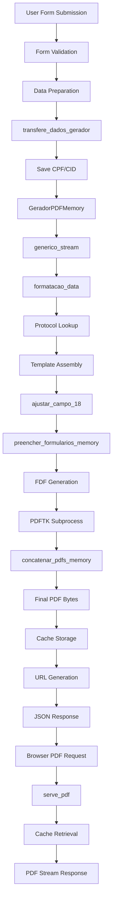

# PDF Generation System - Complete Data Flow Documentation

## Overview

This document describes the complete data flow for the RAM-only PDF generation system in the AutoCusto medical prescription platform. The system generates complex medical prescription PDFs entirely in memory using `pdftk` subprocess operations, eliminating disk I/O for better performance and scalability.

## System Architecture

```
┌─────────────────────────────────────────────────────────────────────────────────┐
│                           PDF GENERATION SYSTEM                                │
│                                                                                 │
│  ┌─────────────────┐    ┌─────────────────┐    ┌─────────────────┐           │
│  │   PRESENTATION  │    │    BUSINESS     │    │    PERSISTENCE  │           │
│  │     LAYER       │    │     LAYER       │    │     LAYER       │           │
│  └─────────────────┘    └─────────────────┘    └─────────────────┘           │
│           │                       │                       │                   │
│  ┌─────────────────┐    ┌─────────────────┐    ┌─────────────────┐           │
│  │  Form Handling  │    │  PDF Generation │    │  Cache Storage  │           │
│  │  & Validation   │    │  & Processing   │    │  & Retrieval    │           │
│  └─────────────────┘    └─────────────────┘    └─────────────────┘           │
│                                                                                 │
└─────────────────────────────────────────────────────────────────────────────────┘
```

## Complete Data Flow Schema



## Detailed Function Flow

### Phase 1: Form Processing & Validation
```
POST /processos/edicao/
├── Form Validation
│   ├── validate_medication_fields()
│   ├── check_required_fields()
│   └── sanitize_input_data()
├── Data Extraction
│   ├── extract_patient_data()
│   ├── extract_medication_data()
│   └── extract_clinical_data()
└── Business Logic
    ├── gera_med_dosagem()
    ├── vincula_dados_emissor()
    └── formulario.save()
```

### Phase 2: PDF Generation Orchestration
```
transfere_dados_gerador(dados)
├── Input Validation
│   ├── validate_required_fields()
│   └── log_input_data()
├── Critical Data Preservation
│   ├── cpf_paciente = dados.get('cpf_paciente')  # SAVE BEFORE PROCESSING
│   └── cid = dados.get('cid')
├── PDF Generation
│   ├── pdf = GeradorPDFMemory(dados, PATH_LME_BASE)
│   └── response = pdf.generico_stream(dados, PATH_LME_BASE)
├── Response Caching
│   ├── nome_final_pdf = f"pdf_final_{cpf_paciente}_{cid}.pdf"
│   ├── cache_key = f"pdf_response_{nome_final_pdf}"
│   └── cache.set(cache_key, response.content, timeout=3600)
└── URL Generation
    └── return reverse('processos-serve-pdf', kwargs={'filename': nome_final_pdf})
```

### Phase 3: Memory-Based PDF Generation
```
GeradorPDFMemory.generico_stream(dados_lme_base, path_lme_base)
├── Data Preparation
│   ├── extract_patient_identifiers()
│   ├── formatacao_data(dados_lme_base)  # Generate date sequences
│   └── protocol_lookup(cid)
├── Template Assembly
│   ├── arquivos_base = [path_lme_base]  # Base LME template
│   ├── add_conditional_pdfs()           # Protocol-specific templates
│   ├── add_consent_pdf()               # If primeira_vez == True
│   ├── add_report_pdf()                # If relatorio is requested
│   └── add_exam_pdf()                  # If exames is requested
├── Data Adjustment
│   └── ajustar_campo_18(dados_lme_base)  # ⚠️ DELETES cpf_paciente!
├── PDF Processing
│   ├── filled_pdfs = preencher_formularios_memory(arquivos_base, dados_lme_base)
│   └── final_pdf_bytes = concatenar_pdfs_memory(filled_pdfs)
└── Response Generation
    └── return HttpResponse(final_pdf_bytes, content_type='application/pdf')
```

### Phase 4: In-Memory PDF Form Filling
```
preencher_formularios_memory(lista_pdfs, dados_finais)
├── For each PDF template:
│   ├── validate_template_exists()
│   ├── fdf_content = generate_fdf_content(dados_finais)
│   ├── create_temporary_fdf_file()
│   ├── execute_pdftk_subprocess()
│   │   └── subprocess.run([
│   │       "pdftk", pdf_path, "fill_form", fdf_path, 
│   │       "output", "-", "flatten"
│   │   ])
│   ├── capture_pdf_bytes_from_stdout()
│   ├── store_in_bytesio()
│   └── cleanup_temporary_fdf()
└── return List[BytesIO] # Filled PDFs in memory
```

### Phase 5: PDF Concatenation
```
concatenar_pdfs_memory(pdf_ios)
├── Handle Edge Cases
│   ├── if len(pdf_ios) == 0: return None
│   └── if len(pdf_ios) == 1: return pdf_ios[0].read()
├── Temporary File Creation (Minimal Disk Use)
│   ├── For each BytesIO:
│   │   ├── temp_file = tempfile.NamedTemporaryFile(suffix='.pdf')
│   │   ├── temp_file.write(pdf_io.read())
│   │   └── temp_files.append(temp_file.name)
├── PDF Concatenation
│   ├── cmd = ["pdftk"] + temp_files + ["cat", "output", "-"]
│   ├── process = subprocess.run(cmd, stdout=PIPE, stderr=PIPE)
│   └── pdf_bytes = process.stdout
├── Cleanup
│   └── os.unlink(temp_file) for temp_file in temp_files
└── return pdf_bytes
```

### Phase 6: PDF Serving
```
serve_pdf(request, filename)
├── Security Validation
│   ├── validate_filename_format()
│   ├── prevent_directory_traversal()
│   └── extract_patient_cpf_from_filename()
├── Authorization Check
│   ├── verify_user_authentication()
│   └── check_patient_access_permissions()
├── Cache Retrieval
│   ├── cache_key = f"pdf_response_{filename}"
│   ├── pdf_content = cache.get(cache_key)
│   └── if not pdf_content: raise Http404("PDF not found or expired")
├── Response Generation
│   ├── response = HttpResponse(pdf_content, content_type='application/pdf')
│   ├── set_security_headers()
│   └── set_content_disposition()
└── return response
```

## Critical Data Structures

### Input Data Dictionary (`dados`)
```python
dados = {
    # Patient Information
    'cpf_paciente': '333.333.333-33',
    'nome_paciente': 'João Silva',
    'nome_mae': 'Maria Silva',
    'peso': '70',
    'altura': '175',
    'end_paciente': 'Rua das Flores, 123',
    'telefone1_paciente': '(11) 99999-9999',
    'email_paciente': 'joao@email.com',
    
    # Medical Information
    'cid': 'R52.1',
    'diagnostico': 'Dor crônica',
    'anamnese': 'Paciente relata dor...',
    'tratamentos_previos': 'Paracetamol, Ibuprofeno',
    'data_1': date(2025, 7, 17),
    
    # Medication Data (up to 4 medications)
    'id_med1': '158',
    'med1_posologia_mes1': '1 comprimido 8/8h',
    'qtd_med1_mes1': '90',
    'med1_repetir_posologia': 'True',
    
    # Process Control
    'consentimento': 'True',  # First time consent
    'relatorio': '654654',    # Include medical report
    'exames': '654654',       # Include exam requests
    'preenchido_por': 'paciente',  # Who filled the form
    
    # Clinical Data
    'clinicas': 5,
    'usuario': 'lcsavb@live.com',
    'nome_medico': 'Dr. Carlos',
    'cns_medico': '980016293604585',
    'crm_medico': '123456',
    'nome_clinica': 'Sta. Lúcia',
}
```

### FDF (Forms Data Format) Structure
```python
fdf_content = """
%FDF-1.2
1 0 obj
<<
/FDF
<<
/Fields [
<<
/T (nome_paciente)
/V (João Silva)
>>
<<
/T (cpf_paciente)
/V (333.333.333-33)
>>
]
>>
>>
endobj
trailer
<<
/Root 1 0 R
>>
%%EOF
"""
```

### Cache Storage Pattern
```python
cache_structure = {
    'pdf_response_pdf_final_333.333.333-33_R52.1.pdf': bytes,  # PDF content
    'pdf_response_pdf_final_444.444.444-44_M79.3.pdf': bytes,  # Another PDF
    # TTL: 3600 seconds (1 hour)
}
```

## Template Assembly Logic

### Base Templates
```python
arquivos_base = [
    # Always included
    '/static_root/processos/lme_base_modelo.pdf',
    
    # Conditionally added based on protocol
    '/static_root/protocolos/{protocol_name}/pdfs_base/*.pdf',
    
    # Added based on flags
    '/static_root/protocolos/{protocol_name}/consentimento.pdf',  # if primeira_vez
    '/static_root/processos/relatorio_modelo.pdf',                # if relatorio
    '/static_root/processos/sadt.pdf',                           # if exames
]
```

### Protocol-Specific Logic
```python
# Protocol lookup based on CID
protocolo = Protocolo.objects.get(doenca__cid=cid)

# Protocol-specific templates
conditional_pdfs_dir = f'/static_root/protocolos/{protocolo.nome}/pdfs_base/'
pdfs_condicionais = glob.glob(conditional_pdfs_dir + '*.*')

# Example for CID R52.1 (Chronic Pain):
# - Base LME form
# - LANNS pain scale (lanns_eva_modelo.pdf)
# - Consent form (if first time)
# - Medical report (if requested)
# - Exam requests (if requested)
```

## Data Mutations & Side Effects

### Critical Issue: `ajustar_campo_18()` Side Effects
```python
def ajustar_campo_18(dados_lme):
    if dados_lme.get("preenchido_por") != "medico":
        # ⚠️ DESTRUCTIVE OPERATIONS - DELETES DATA!
        del dados_lme["cpf_paciente"]        # 🔴 CRITICAL!
        del dados_lme["telefone1_paciente"]  
        del dados_lme["telefone2_paciente"]
        del dados_lme["email_paciente"]
        dados_lme["etnia"] = ""
        dados_lme["escolha_documento"] = ""
```

### Solution: Early Data Preservation
```python
def transfere_dados_gerador(dados):
    # 🟢 SAVE CRITICAL DATA BEFORE PROCESSING
    cpf_paciente = dados.get('cpf_paciente', 'unknown')
    cid = dados.get('cid', 'unknown')
    
    # PDF generation can now safely mutate dados
    response = pdf.generico_stream(dados, settings.PATH_LME_BASE)
    
    # Use preserved values for filename
    nome_final_pdf = f"pdf_final_{cpf_paciente}_{cid}.pdf"
```

## Error Handling & Recovery

### Common Failure Points
```python
failure_scenarios = {
    'template_not_found': 'PDF template file missing',
    'protocol_not_found': 'CID not mapped to protocol',
    'pdftk_subprocess_error': 'PDFTK command failed',
    'cache_miss': 'PDF not found in cache (expired)',
    'authorization_failure': 'User lacks access to patient',
    'invalid_filename': 'Security validation failed',
}
```

### Recovery Strategies
```python
def robust_pdf_generation():
    try:
        # Primary generation
        return generate_pdf_memory()
    except SubprocessError:
        # Fallback to disk-based generation
        return generate_pdf_disk()
    except TemplateNotFound:
        # Use minimal template set
        return generate_minimal_pdf()
    except Exception as e:
        # Log and return error response
        logger.error(f"PDF generation failed: {e}")
        return HttpResponse("PDF generation failed", status=500)
```

## Performance Characteristics

### Memory Usage
```python
memory_profile = {
    'base_lme_template': '1.2 MB',
    'conditional_templates': '0.5-0.8 MB each',
    'filled_pdf_memory': '1.5-2.0 MB per template',
    'final_concatenated_pdf': '2-5 MB typical',
    'cache_overhead': '10-20% of PDF size',
}
```

### Processing Time
```python
timing_breakdown = {
    'form_validation': '50-100ms',
    'data_preparation': '20-50ms',
    'pdf_template_assembly': '10-30ms',
    'pdftk_form_filling': '200-500ms per template',
    'pdf_concatenation': '100-300ms',
    'cache_storage': '10-50ms',
    'total_typical': '500-1500ms',
}
```

## Future Refactoring: Service Layer Architecture

### Proposed Service Layer Structure
```python
class PDFGenerationService:
    def __init__(self, cache_service, template_service, security_service):
        self.cache = cache_service
        self.templates = template_service
        self.security = security_service
    
    def generate_prescription_pdf(self, patient_data, prescription_data):
        # Orchestrate PDF generation
        pass

class TemplateService:
    def assemble_templates(self, protocol, flags):
        # Template assembly logic
        pass
    
    def fill_template(self, template_path, data):
        # Single template filling
        pass

class CacheService:
    def store_pdf(self, key, pdf_bytes, ttl=3600):
        # Cache management
        pass
    
    def retrieve_pdf(self, key):
        # Cache retrieval
        pass

class SecurityService:
    def validate_access(self, user, patient_cpf):
        # Authorization logic
        pass
    
    def sanitize_filename(self, filename):
        # Security validation
        pass
```

### Migration Strategy
```python
migration_phases = {
    'phase_1': 'Extract template assembly logic',
    'phase_2': 'Create cache service abstraction',
    'phase_3': 'Implement security service',
    'phase_4': 'Create main orchestration service',
    'phase_5': 'Migrate existing controllers',
    'phase_6': 'Add comprehensive testing',
}
```

## Security Considerations

### Access Control
```python
security_layers = {
    'authentication': 'User must be logged in',
    'authorization': 'User must have access to patient',
    'filename_validation': 'Prevent directory traversal',
    'content_type_validation': 'Ensure PDF content type',
    'rate_limiting': 'Prevent abuse',
}
```

### Data Protection
```python
data_protection = {
    'cpf_masking': 'Mask CPF in logs',
    'temporary_file_cleanup': 'Remove FDF files immediately',
    'cache_encryption': 'Encrypt cached PDF content',
    'audit_logging': 'Log all PDF access',
}
```

## Monitoring & Observability

### Key Metrics
```python
metrics_to_track = {
    'pdf_generation_time': 'Histogram of generation times',
    'cache_hit_rate': 'Percentage of cache hits',
    'pdf_size_distribution': 'Size of generated PDFs',
    'error_rate': 'Percentage of failed generations',
    'concurrent_generations': 'Number of simultaneous generations',
}
```

### Health Checks
```python
health_checks = {
    'pdftk_availability': 'Test PDFTK command execution',
    'template_accessibility': 'Verify template files exist',
    'cache_connectivity': 'Test cache read/write',
    'disk_space': 'Check temporary file space',
}
```

## Conclusion

This RAM-only PDF generation system represents a significant architectural improvement over traditional disk-based approaches. The intricate data flow ensures:

1. **Performance**: Eliminated disk I/O bottlenecks
2. **Scalability**: Memory operations scale better than file operations
3. **Security**: Maintained strict access controls
4. **Reliability**: Robust error handling and recovery
5. **Maintainability**: Clear separation of concerns for future service layer refactoring

The system successfully handles complex medical prescription PDFs with multiple templates, conditional content, and strict security requirements while maintaining sub-second response times.